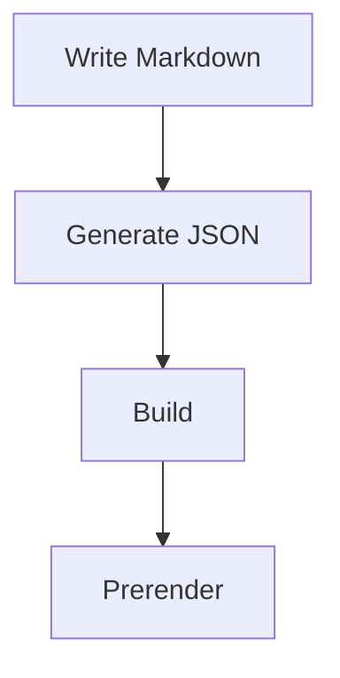
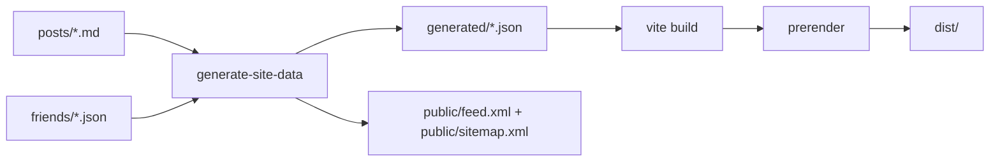

# D-blog

<div align="center">


一个基于 React + Vite 的静态博客项目，支持 Markdown 写作、分类与标签浏览、全文搜索、RSS、站点地图、静态预渲染，以及基于 Cloudflare Analytics 的访问统计。

[在线预览](https://blog.pldduck.com) | [快速开始](#快速开始) | [部署说明](#部署说明)

</div>

## 项目特性

### 内容驱动

- 使用 `posts/*.md` 管理文章，Front Matter 自动解析
- 使用 `friends/*.json` 管理友情链接
- 支持分类、标签、置顶、精选、封面图、阅读时长等字段
- 构建时自动生成 `generated/posts.json` 和 `generated/friends.json`

### 阅读体验

- 首页支持分类筛选、排序切换、分页和全文搜索
- 文章页支持代码高亮、数学公式、Mermaid 图表、图片预览、代码复制、目录导航
- 自动生成 `public/feed.xml` 与 `public/sitemap.xml`
- 构建后对文章页和主要静态页执行预渲染，提升 SEO 和首屏速度

### 部署友好

- 输出产物为静态文件，可部署到 Cloudflare Pages、Vercel、Netlify、Nginx
- 内置 `functions/api/cloudflare-stats.ts`，可在 Cloudflare Pages Functions 中实时拉取统计数据
- 未配置 Cloudflare 环境变量时，会自动回退到构建产出的静态快照

## 技术栈

| 类别 | 技术 |
| --- | --- |
| 前端框架 | React 19 |
| 构建工具 | Vite 6 |
| 语言 | TypeScript |
| 路由 | React Router DOM 6 |
| 样式 | Tailwind CSS |
| 动效 | Framer Motion |
| Markdown 渲染 | React Markdown + Remark GFM |
| 扩展能力 | Rehype Highlight、KaTeX、Mermaid |
| 数据解析 | Gray Matter |

## 目录结构

```text
D-blog/
|-- config/
|   |-- postcss.config.js
|   |-- site.config.ts
|   |-- tailwind.config.js
|   `-- tsconfig.json
|-- friends/                    # 友情链接 JSON
|-- functions/
|   `-- api/
|       `-- cloudflare-stats.ts # Cloudflare Pages Functions API
|-- posts/                      # Markdown 文章
|-- public/                     # 静态资源、RSS、站点地图等
|-- scripts/
|   |-- generate-site-data.mjs  # 生成文章/友链/统计快照/RSS/Sitemap
|   `-- prerender.mjs           # 为文章和关键页面生成静态 HTML
|-- src/
|   |-- components/
|   |-- hooks/
|   |-- pages/
|   |-- services/
|   |-- App.tsx
|   |-- index.css
|   |-- index.tsx
|   `-- types.ts
|-- .env.example
|-- index.html
|-- package.json
`-- vite.config.ts
```

## 快速开始

### 环境要求

- Node.js >= 20
- npm >= 10

### 安装依赖

```bash
git clone https://github.com/ououduck/D-blog.git
cd D-blog
npm install
```

### 本地开发

```bash
npm run dev
```

开发命令会先执行一次数据生成脚本，再启动 Vite 开发服务器。默认访问地址为 `http://localhost:5173`。

### 生产构建

```bash
npm run build
```

构建流程如下：

1. 读取 `posts/` 与 `friends/`，生成结构化数据
2. 拉取或生成 Cloudflare 统计快照
3. 生成 `feed.xml` 与 `sitemap.xml`
4. 执行 `vite build`
5. 对文章页、归档页、标签页、统计页、关于页、友链页进行预渲染

构建产物位于 `dist/`。

### 预览构建结果

```bash
npm run preview
```

## 可用脚本

```bash
npm run gen:data    # 仅生成 posts/friends/rss/sitemap/cloudflare 快照
npm run dev         # 生成数据并启动开发环境
npm run build       # 生成数据、打包并预渲染
npm run preview     # 本地预览 dist
```

## 内容管理

### 新建文章

在 [`posts/`](./posts) 下新增 Markdown 文件，例如 `my-first-post.md`：

```yaml
---
id: my-first-post
title: 我的第一篇文章
excerpt: 这是一段文章摘要，会用于列表展示和 SEO 描述
date: 2026-03-14
category: 随笔
tags:
  - React
  - Vite
readTime: 5 分钟
coverImage: /posts-img/example.png
featured: false
top: 1
---

# 正文标题

这里开始写正文，支持标准 Markdown、GFM 表格、代码块等内容。
```

字段说明：

- `id`：文章唯一标识，对应路由 `/post/:id`
- `title`：文章标题
- `excerpt`：文章摘要
- `date`：发布日期，建议使用 `YYYY-MM-DD`
- `category`：分类名称
- `tags`：标签数组
- `readTime`：阅读时长文案
- `coverImage`：封面图路径
- `featured`：是否作为首页精选卡片展示
- `top`：置顶排序，数字越小优先级越高，可选

### Markdown 增强能力

文章页会按内容自动加载对应能力：

- 代码块：启用语法高亮和代码复制按钮
- 数学公式：启用 `remark-math` + `rehype-katex`
- Mermaid：渲染流程图、时序图等
- 图片：支持点击放大预览

示例：

````md
```ts
console.log('hello D-blog');
```

$$
E = mc^2
$$


````

### 新建友情链接

在 [`friends/`](./friends) 下新增 JSON 文件：

```json
{
  "name": "示例站点",
  "description": "这里填写站点简介",
  "avatar": "https://example.com/avatar.png",
  "url": "https://example.com"
}
```

所有字段都必须为非空字符串。构建脚本会跳过格式不正确的文件。

### 站点配置

主要配置位于 [`config/site.config.ts`](./config/site.config.ts)，可修改：

- 站点标题、副标题、描述、Logo、SEO 图片
- 作者信息
- 社交链接
- 友情链接页说明
- 备案信息

## 数据与构建流程

### 数据生成

[`scripts/generate-site-data.mjs`](./scripts/generate-site-data.mjs) 会完成以下工作：

- 解析 `posts/*.md` Front Matter
- 提取正文纯文本，生成搜索索引字段 `searchText`
- 校验 `friends/*.json`
- 生成 `generated/posts.json` 与 `generated/friends.json`
- 生成 `public/feed.xml` 与 `public/sitemap.xml`
- 生成 `generated/cloudflare.json`

### 页面预渲染

[`scripts/prerender.mjs`](./scripts/prerender.mjs) 会基于 `dist/index.html` 生成以下页面的静态入口：

- 所有文章页 `/post/:id`
- `/archive`
- `/tags`
- `/stats`
- `/about`
- `/friends`

### 流程图



## Cloudflare 统计配置

统计页依赖两个环境变量：

```bash
CLOUDFLARE_API_TOKEN=your_api_token
CLOUDFLARE_ZONE_ID=your_zone_id
```

相关行为：

- 构建阶段：`generate-site-data.mjs` 会尝试拉取最近 `1 / 7 / 30` 天的统计快照并写入 `generated/cloudflare.json`
- 运行阶段：Cloudflare Pages Functions 中的 [`functions/api/cloudflare-stats.ts`](./functions/api/cloudflare-stats.ts) 可实时返回最新统计
- 缺少环境变量时：统计页展示降级数据或空状态，不影响整体构建

建议为 API Token 至少授予可读取 Cloudflare Analytics 的权限。

## 部署说明

### Cloudflare Pages

推荐使用 Cloudflare Pages，项目已包含：

- `_routes.json`
- `_redirects`
- `_headers`
- `functions/api/cloudflare-stats.ts`

构建配置：

```text
Build command: npm run build
Build output directory: dist
```

如需启用统计页实时数据，再补充以下环境变量：

```text
CLOUDFLARE_API_TOKEN=your_api_token
CLOUDFLARE_ZONE_ID=your_zone_id
```

### Vercel

```bash
npm i -g vercel
vercel
```

或在控制台中设置：

- Framework Preset: `Vite`
- Build Command: `npm run build`
- Output Directory: `dist`

### Netlify

```bash
npm i -g netlify-cli
netlify deploy --prod
```

如果需要 SPA 回退，可使用以下配置：

```toml
[build]
  command = "npm run build"
  publish = "dist"

[[redirects]]
  from = "/*"
  to = "/index.html"
  status = 200
```

### Nginx

```nginx
server {
    listen 80;
    server_name your-domain.com;
    root /var/www/blog/dist;
    index index.html;

    location / {
        try_files $uri $uri/ /index.html;
    }

    location ~* \.(js|css|png|jpg|jpeg|gif|ico|svg|woff|woff2)$ {
        expires 1y;
        add_header Cache-Control "public, immutable";
    }
}
```

## 贡献指南

欢迎提交 Issue 和 Pull Request。

### 提交文章

1. Fork 仓库
2. 在 [`posts/`](./posts) 下新增文章
3. 本地执行 `npm run build`
4. 提交 PR，说明文章主题与主要内容

### 申请友情链接

1. Fork 仓库
2. 在 [`friends/`](./friends) 下新增 JSON 文件
3. 确保字段完整且链接有效
4. 提交 PR

### 代码贡献

1. Fork 并创建分支
2. 完成修改后执行 `npm run build`
3. 使用清晰的提交信息，推荐遵循 Conventional Commits
4. 提交 PR 并说明变更原因、影响范围和验证方式

## License

本项目基于 [MIT](./LICENSE) 协议开源。
