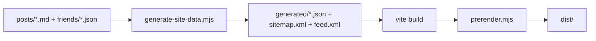

# D-blog

<div align="center">


一个现代化的静态博客系统，基于 React + Vite 构建，支持 Markdown 内容管理、友情链接、RSS 订阅、SEO 优化和响应式设计。

[在线预览](https://blog.pldduck.com) · [快速开始](#快速开始) · [部署指南](#部署说明)

</div>

## ✨ 核心特性

### 📝 内容管理
- **Markdown 驱动** - 文章直接存放在 `posts/` 目录，支持 Front Matter 元数据
- **无需数据库** - 构建期自动生成文章索引和友链数据
- **灵活分类** - 支持文章分类、标签、置顶和精选展示
- **全文搜索** - 内置文章搜索和筛选功能

### 🚀 性能优化
- **预渲染** - 构建时生成静态 HTML，提升首屏加载速度
- **SEO 友好** - 自动生成 `sitemap.xml` 和 `feed.xml`
- **响应式设计** - 完美适配桌面端和移动端
- **代码高亮** - 支持多种编程语言语法高亮

### 🔧 开发体验
- **热更新** - Vite 提供极速的开发体验
- **TypeScript** - 完整的类型支持
- **组件化** - 基于 React 19 的现代化组件架构
- **易于定制** - 清晰的配置文件和目录结构

### 🌐 部署灵活
- 支持 Cloudflare Pages、Vercel、Netlify 等平台
- 可部署到传统 Nginx 服务器
- 集成 Cloudflare Analytics 统计功能

## 🛠️ 技术栈

| 类别 | 技术 |
|------|------|
| 框架 | React 19 + Vite 6 |
| 语言 | TypeScript |
| 样式 | Tailwind CSS |
| 动画 | Framer Motion |
| 路由 | React Router v7 |
| Markdown | React Markdown + Remark GFM + Rehype Highlight |
| 元数据解析 | Gray Matter |
| 数学公式 | KaTeX |
| 图表 | Mermaid |

## 📁 目录结构

```text
D-blog/
├── config/                 # 配置文件
│   ├── site.config.ts     # 站点配置（标题、作者、社交链接等）
│   ├── tailwind.config.js # Tailwind CSS 配置
│   ├── postcss.config.js  # PostCSS 配置
│   └── tsconfig.json      # TypeScript 配置
├── friends/               # 友情链接数据（JSON 格式）
├── posts/                 # 博客文章（Markdown 格式）
├── public/                # 静态资源
│   ├── posts-img/        # 文章图片
│   ├── sitemap.xml       # 站点地图（自动生成）
│   ├── feed.xml          # RSS 订阅源（自动生成）
│   ├── _redirects        # SPA 路由配置
│   ├── _headers          # 安全响应头配置
│   └── _routes.json      # Cloudflare Pages 路由配置
├── scripts/               # 构建脚本
│   ├── generate-site-data.mjs  # 生成站点数据
│   └── prerender.mjs           # 预渲染静态页面
├── src/                   # 前端源码
│   ├── components/       # React 组件
│   ├── pages/            # 页面组件
│   ├── services/         # 数据服务
│   ├── types.ts          # TypeScript 类型定义
│   ├── App.tsx           # 应用入口
│   └── index.tsx         # 渲染入口
├── functions/             # Cloudflare Pages Functions
│   └── api/              # API 端点
├── generated/             # 构建生成的数据（自动生成，不提交到 Git）
├── .env.example          # 环境变量示例
├── index.html            # HTML 模板
├── package.json          # 项目依赖
└── vite.config.ts        # Vite 配置
```

## 🚀 快速开始

### 环境要求

- Node.js >= 20
- npm >= 10

### 安装

```bash
# 克隆仓库
git clone https://github.com/ououduck/D-blog.git
cd D-blog

# 安装依赖
npm install
```

### 开发

```bash
npm run dev
```

启动后会自动执行数据生成脚本，然后进入 Vite 开发模式，访问 `http://localhost:5173`

### 构建

```bash
npm run build
```

构建流程：
1. 生成站点数据（文章索引、友链、RSS、Sitemap）
2. Vite 打包前端资源
3. 预渲染静态页面

构建产物位于 `dist/` 目录，可直接部署。

### 预览

```bash
npm run preview
```

本地预览构建后的生产版本。

## 📝 内容管理

### 新增文章

在 `posts/` 目录下创建 `.md` 文件，使用以下 Front Matter 格式：

```yaml
---
id: my-first-post           # 文章唯一标识，对应路由 /post/:id
title: 文章标题              # 文章标题
excerpt: 文章摘要            # 列表摘要和 SEO 描述
date: 2026-03-08            # 发布日期（YYYY-MM-DD）
category: 随笔               # 分类名称
tags:                       # 标签数组
  - React
  - Vite
readTime: 5分钟阅读          # 阅读时长
coverImage: /posts-img/example.png  # 封面图路径
featured: false             # 是否精选展示
top: 1                      # 置顶优先级（数值越小优先级越高，可选）
---

# 文章内容

这里是文章正文，支持完整的 Markdown 语法...
```

### 新增友情链接

在 `friends/` 目录下创建 `.json` 文件（建议使用站点域名或英文名称命名）：

```json
{
  "name": "站点名称",
  "description": "站点简介",
  "avatar": "https://example.com/avatar.png",
  "url": "https://example.com"
}
```

所有字段均为必填项。构建脚本会自动跳过字段缺失或格式错误的文件。

### 站点配置

编辑 `config/site.config.ts` 修改站点信息：

```typescript
export const siteConfig = {
  title: "站点标题",
  subtitle: "站点副标题",
  description: "站点描述",
  url: "https://your-domain.com",
  author: {
    name: "作者名称",
    avatar: "头像URL",
    role: "角色描述",
    bio: "个人简介"
  },
  social: {
    github: "GitHub链接",
    email: "邮箱地址"
  },
  // ... 更多配置
};
```

## 🔨 构建流程

项目采用三阶段构建流程：



1. **数据生成阶段** - `scripts/generate-site-data.mjs`
   - 解析 Markdown Front Matter
   - 校验友链数据
   - 生成文章索引
   - 生成 RSS 订阅源
   - 生成站点地图

2. **打包阶段** - `vite build`
   - 编译 TypeScript
   - 打包 React 组件
   - 优化静态资源
   - 生成生产版本

3. **预渲染阶段** - `scripts/prerender.mjs`
   - 为文章页生成静态 HTML
   - 为关于页生成静态 HTML
   - 为友链页生成静态 HTML
   - 提升 SEO 和首屏性能

## 🚢 部署说明

构建产物为纯静态文件（`dist/`），可部署到任意静态托管平台。

### Cloudflare Pages（推荐）

本项目针对 Cloudflare Pages 进行了深度优化，开箱即用。

#### 快速部署

1. 登录 [Cloudflare Dashboard](https://dash.cloudflare.com/)
2. 进入 Pages，点击「创建项目」
3. 连接 GitHub 仓库
4. 配置构建设置：
   ```
   构建命令：npm run build
   输出目录：dist
   Node 版本：20（自动检测）
   ```
5. 添加环境变量（可选，用于统计功能）：
   ```
   CLOUDFLARE_API_TOKEN=your_api_token
   CLOUDFLARE_ZONE_ID=your_zone_id
   ```
6. 保存并部署

#### 内置特性

- ✅ SPA 路由自动回退
- ✅ 安全响应头配置
- ✅ 静态资源缓存优化
- ✅ Cloudflare Analytics 集成
- ✅ 自动构建和部署

### Vercel

```bash
# 使用 Vercel CLI 部署
npm i -g vercel
vercel
```

或在 Vercel Dashboard 中配置：
- Framework Preset: `Vite`
- Build Command: `npm run build`
- Output Directory: `dist`

### Netlify

```bash
# 使用 Netlify CLI 部署
npm i -g netlify-cli
netlify deploy --prod
```

或在 `netlify.toml` 中配置：
```toml
[build]
  command = "npm run build"
  publish = "dist"

[[redirects]]
  from = "/*"
  to = "/index.html"
  status = 200
```

### Nginx

```nginx
server {
    listen 80;
    server_name your-domain.com;
    root /var/www/blog/dist;
    index index.html;

    # SPA 路由回退
    location / {
        try_files $uri $uri/ /index.html;
    }

    # 静态资源缓存
    location ~* \.(js|css|png|jpg|jpeg|gif|ico|svg|woff|woff2)$ {
        expires 1y;
        add_header Cache-Control "public, immutable";
    }

    # Gzip 压缩
    gzip on;
    gzip_types text/plain text/css application/json application/javascript text/xml application/xml application/xml+rss text/javascript;
}
```

## 🤝 贡献指南

欢迎提交 Issue 和 Pull Request！

### 提交文章

1. Fork 本仓库
2. 在 `posts/` 目录下创建 Markdown 文件
3. 确保 Front Matter 字段完整且格式正确
4. 本地执行 `npm run build` 验证构建通过
5. 提交 PR，标题格式：`docs: 新增文章 - [文章标题]`

### 申请友链

1. Fork 本仓库
2. 在 `friends/` 目录下创建 JSON 文件（建议使用域名或英文名称命名）
3. 确保包含所有必填字段：`name`、`description`、`avatar`、`url`
4. 确认已添加本站友链
5. 提交 PR，标题格式：`feat: 添加友链 - [站点名称]`

### 代码贡献

1. Fork 本仓库并创建新分支
2. 进行代码修改
3. 确保代码风格一致
4. 执行 `npm run build` 验证构建通过
5. 提交 PR，清晰描述改动内容

#### 开发规范

- 遵循项目现有的代码风格和目录结构
- PR 聚焦单一主题，便于审查和回滚
- 提交信息遵循 [Conventional Commits](https://www.conventionalcommits.org/) 规范
- 重大改动请先开 Issue 讨论

## 📊 Cloudflare Analytics 统计

项目内置 Cloudflare Analytics 统计功能，访问 `/stats` 查看站点数据。

### 工作原理

- **实时模式**：通过 Cloudflare Pages Functions (`/api/cloudflare-stats`) 实时获取数据
- **降级模式**：API 不可用时使用构建时生成的静态数据 (`generated/cloudflare.json`)
- **缓存策略**：前端缓存 5 分钟，支持手动刷新
- **安全策略**：API Token 配置在环境变量中，不暴露给前端

### 配置方法

1. 登录 [Cloudflare Dashboard](https://dash.cloudflare.com/)
2. 创建 API Token（需要 Analytics Read 权限）
3. 获取站点的 Zone ID
4. 在 Cloudflare Pages 项目设置中添加环境变量：
   ```
   CLOUDFLARE_API_TOKEN=your_api_token
   CLOUDFLARE_ZONE_ID=your_zone_id
   ```

说明：由于 Cloudflare Zone ID 统计以主域名为单位，当前统计页统一使用 `pldduck.com` 的 Zone 数据，并仅展示稳定可获取的核心指标。

本地开发时可参考 `.env.example` 配置环境变量。

## 📄 License

本项目采用 [MIT License](LICENSE) 开源协议。

## 🙏 致谢

感谢所有为本项目做出贡献的开发者！

---

<div align="center">

如果这个项目对你有帮助，欢迎 Star ⭐️

[报告问题](https://github.com/ououduck/D-blog/issues) · [功能建议](https://github.com/ououduck/D-blog/issues) · [贡献代码](https://github.com/ououduck/D-blog/pulls)

</div>
