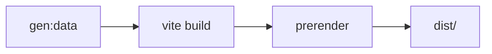
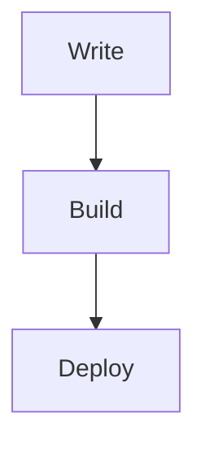

# D-blog

<div align="center">


基于 React 19 + Vite 6 + TypeScript 构建的现代化静态博客系统

**在线演示**：<https://blog.pldduck.com>

</div>

## 目录

- [核心特性](#核心特性)
- [技术栈](#技术栈)
- [快速开始](#快速开始)
- [构建流程](#构建流程)
- [项目结构](#项目结构)
- [内容管理](#内容管理)
  - [新建文章](#新建文章)
  - [Markdown 增强](#markdown-增强)
  - [新建友链](#新建友链)
  - [封面生成器](#封面生成器)
- [配置指南](#配置指南)
  - [站点配置](#站点配置)
  - [赞助页面配置](#赞助页面配置)
  - [广告配置](#广告配置)
- [NPM 脚本](#npm-脚本)
- [部署指南](#部署指南)
- [贡献指南](#贡献指南)
- [许可证](#许可证)

---

## 核心特性

### 内容与写作

- **Markdown 驱动** - 使用 Markdown 文件管理内容，支持 Front Matter 元数据
- **全文搜索** - 构建时生成搜索索引，前端按标题/分类/正文/标签多维度权重评分搜索，支持搜索范围筛选（标题、分类、正文内容）和搜索历史记录
- **增强渲染** - 代码高亮（highlight.js）、数学公式（KaTeX）、Mermaid 图表、GFM 表格、图片预览
- **阅读体验** - 目录导航（自动折叠非活跃分支）、阅读进度徽章、文章封面图、阅读时间估算

### 用户体验

- **主题系统** - 浅色/深色/跟随系统三种模式，切换时支持 CSS View Transitions API 动画过渡
- **页面过渡** - 支持 CSS View Transitions API 圆形揭示动画（兜底使用 Framer Motion），点击位置决定动画原点
- **导航体验** - 全局搜索弹窗（Ctrl+K 快捷键）、响应式导航栏、移动端底部菜单（下滑手势关闭）
- **品牌加载动画** - 首次访问时显示字母打字动画 + 进度条的品牌加载效果

### 性能与构建

- **预渲染** - 为每篇文章和静态页面生成独立 HTML，注入精准的 SEO meta 标签和 JSON-LD 结构化数据
- **代码分割** - 基于路由懒加载，第三方库按功能分包（React 核心、路由、动画、Markdown、代码高亮、Mermaid 图表等）
- **资源优化** - 构建时压缩（Terser）、去 console、文件名哈希缓存、CSS 代码分割
- **PWA 支持** - Service Worker 缓存策略，manifest 配置，支持离线访问

### SEO 与订阅

- **自动 SEO** - 每篇文章生成 OG/Twitter Card meta、JSON-LD（Article + BreadcrumbList）结构化数据
- **RSS 订阅** - 自动生成含全文内容的 RSS 2.0 Feed
- **站点地图** - 自动生成 sitemap.xml

## 技术栈

| 技术领域 | 技术选型 |
| --- | --- |
| 前端框架 | React 19 |
| 构建工具 | Vite 6 |
| 开发语言 | TypeScript |
| 路由管理 | React Router DOM 6 |
| 样式方案 | Tailwind CSS + PostCSS |
| 动画库 | Framer Motion + CSS View Transitions API |
| Markdown 渲染 | react-markdown + remark-gfm + remark-math + rehype-highlight + rehype-katex |
| 图表渲染 | Mermaid |
| SEO 优化 | react-helmet-async |
| 图标库 | Lucide React |
| 包管理 | npm |
| 代码压缩 | Terser |

## 快速开始

### 系统要求

- Node.js >= 20.0.0
- npm >= 10.0.0

### 安装部署

```bash
# 克隆项目
git clone https://github.com/ououduck/D-blog.git
cd D-blog

# 安装依赖
npm install

# 配置环境变量（可选，用于覆盖 sitemap/RSS/SEO 的站点 URL）
cp .env.example .env

# 类型检查
npm run typecheck

# 本地开发
npm run dev

# 生产构建
npm run build

# 预览构建结果
npm run preview
```

默认访问地址：<http://localhost:3000>

## 构建流程

项目采用"构建时数据生成 + 预渲染"模式，分三步完成：



1. **数据生成** (`npm run gen:data`) - 读取 `posts/` 目录的 Markdown 文件和 `friends/` 目录的 JSON 文件，生成 `src/generated/` 下的 JSON 数据索引，同时输出 `public/sitemap.xml` 和 `public/feed.xml`
2. **Vite 构建** (`npm run build`) - 将 `src/` 编译为 `dist/` 静态资源
3. **预渲染** (`npm run prerender`) - 为每篇文章（`/post/:id`）和静态页面（`/archive`、`/tags`、`/stats`、`/about`、`/friends`、`/cover`、`/sponsor`、404）生成独立的 `index.html`，注入对应的 SEO meta 标签和 JSON-LD 结构化数据

## 项目结构

```text
D-blog/
├── config/                      # 配置文件
│   ├── site.config.ts          # 站点全局配置（标题、作者、社交链接、备案等）
│   ├── ads.config.ts           # 广告数据配置
│   ├── tailwind.config.js      # Tailwind CSS 配置
│   ├── postcss.config.js       # PostCSS 配置
│   └── tsconfig.json           # TypeScript 配置
├── posts/                       # Markdown 文章内容
├── friends/                     # 友情链接数据（JSON）
├── public/                      # 静态资源
│   ├── posts-img/              # 文章配图
│   ├── ads-img/                # 广告配图
│   ├── feed.xml                # RSS 订阅（自动生成）
│   ├── sitemap.xml             # 站点地图（自动生成）
│   ├── manifest.webmanifest    # PWA 配置清单
│   ├── sw.js                   # Service Worker
│   ├── offline.html            # 离线页面
│   ├── robots.txt              # 爬虫规则
│   ├── pwa-192.png             # PWA 图标
│   ├── pwa-512.png             # PWA 图标
│   ├── logo.png                # 站点 Logo
│   └── favicon.ico             # 站点图标
├── scripts/                     # 构建脚本
│   ├── generate-site-data.mjs  # 数据生成脚本（Markdown → JSON + RSS + Sitemap）
│   └── prerender.mjs           # 预渲染脚本（生成静态 HTML + SEO 标签）
├── src/                         # 源代码
│   ├── components/             # React 组件
│   │   ├── Layout.tsx          # 布局框架（导航栏 + 搜索弹窗 + 页脚 + 背景）
│   │   ├── BackToTop.tsx       # 回到顶部
│   │   ├── CookieNotice.tsx    # Cookie 通知弹窗
│   │   ├── DBlogLoader.tsx     # 品牌加载动画
│   │   ├── GlobalLiquidGlass.tsx # 全局毛玻璃效果
│   │   ├── ImageViewer.tsx     # 图片预览
│   │   ├── NotFoundState.tsx   # 404 状态组件
│   │   ├── ProgressiveImage.tsx # 渐进式图片加载
│   │   ├── ReadingProgressBadge.tsx # 阅读进度徽章
│   │   ├── Seo.tsx             # SEO meta 标签管理
│   │   ├── ShareModal.tsx      # 分享弹窗
│   │   ├── SlideModal.tsx      # 滑动弹窗
│   │   └── TableOfContents.tsx # 文章目录导航
│   ├── pages/                  # 页面组件（懒加载）
│   │   ├── Home.tsx            # 首页
│   │   ├── Post.tsx            # 文章详情页
│   │   ├── Archive.tsx         # 文章归档
│   │   ├── Tags.tsx            # 标签云
│   │   ├── Stats.tsx           # 站点统计（含 Cloudflare 分析数据）
│   │   ├── Friends.tsx         # 友情链接
│   │   ├── About.tsx           # 关于页面
│   │   ├── CoverGenerator.tsx  # 封面生成器
│   │   ├── Sponsor.tsx         # 赞助支持
│   │   └── NotFound.tsx        # 404 页面
│   ├── services/               # 数据服务层
│   │   ├── posts.ts            # 文章数据获取与全文搜索
│   │   ├── friends.ts          # 友链数据获取（随机排序）
│   │   └── siteStats.ts        # 站点统计数据
│   ├── hooks/                  # 自定义 Hooks
│   │   ├── useMediaQuery.ts    # 响应式媒体查询
│   │   ├── useModalOverlay.ts  # 弹窗遮罩管理
│   │   └── usePostSearch.ts    # 文章搜索逻辑
│   ├── utils/                  # 工具函数
│   │   ├── date.ts             # 日期格式化
│   │   ├── debounce.ts         # 防抖函数
│   │   ├── headings.ts         # 标题提取工具
│   │   ├── motion.ts           # Framer Motion 动画配置
│   │   └── preload.ts          # 页面预加载
│   ├── config/                 # 前端配置
│   │   ├── sponsorConfig.ts    # 赞助选项配置
│   │   └── coverTemplates.ts   # 封面模板配置
│   ├── generated/              # 构建时生成的 JSON 数据（自动生成，不提交）
│   │   ├── posts.json          # 文章元数据
│   │   ├── posts-search.json   # 全文搜索索引
│   │   ├── friends.json        # 友链数据
│   │   └── site-stats.json     # 站点统计
│   ├── App.tsx                 # 应用入口（路由配置 + 错误边界 + 加载动画）
│   ├── types.ts                # TypeScript 类型定义
│   ├── index.tsx               # 渲染入口
│   ├── index.css               # 全局样式（Tailwind + 自定义）
│   └── registerServiceWorker.ts # Service Worker 注册
└── vite.config.ts               # Vite 配置（别名、分包策略、压缩配置）
```

## 内容管理

### 新建文章

在 `posts/` 目录下创建 Markdown 文件：

```yaml
---
id: my-first-post
title: 我的第一篇文章
excerpt: 文章摘要，用于列表展示和 SEO
date: 2026-03-14
updatedAt: 2026-03-20            # 可选，最后修改日期
category: 技术                    # 可选值：教程 / 技术 / 随笔 / 分享 / 其他
tags:
  - React
  - Vite
coverImage: /posts-img/example.png # 可选，封面图路径
authors:                           # 可选，多作者支持
  - name: 跑路的duck
    avatar: https://q1.qlogo.cn/g?b=qq&nk=2472652060&s=100
    role: 前端菜鸟
featured: false                   # 是否首页精选展示
top: 1                            # 置顶排序（数字越小优先级越高）
draft: false                      # 是否为草稿
---

# 正文标题

这里开始写正文，支持标准 Markdown、GFM 表格、代码块等。
```

**字段说明**：

| 字段 | 必填 | 说明 |
| --- | --- | --- |
| `id` | 是 | 文章唯一标识，对应路由 `/post/:id` |
| `title` | 是 | 文章标题 |
| `excerpt` | 是 | 文章摘要，用于列表展示和 SEO |
| `date` | 是 | 发布日期（YYYY-MM-DD），缺失会导致构建报错 |
| `updatedAt` | 否 | 最后修改日期 |
| `category` | 否 | 文章分类，默认 `其他`，可选值：教程 / 技术 / 随笔 / 分享 / 其他 |
| `tags` | 否 | 标签数组 |
| `coverImage` | 否 | 封面图路径 |
| `authors` | 否 | 作者信息数组，支持多作者，每项含 `name`/`avatar`/`role`/`bio`/`url` |
| `featured` | 否 | 是否作为首页精选展示 |
| `top` | 否 | 置顶排序（数字越小优先级越高） |
| `draft` | 否 | 是否为草稿（`true` 时构建自动过滤） |

### Markdown 增强

支持以下增强功能：

````md
# 代码高亮
```ts
console.log('hello D-blog');
```

# 数学公式
$$
E = mc^2
$$

# Mermaid 图表


# GFM 表格
| 特性 | 支持 |
| --- | --- |
| 表格 | ✅ |
| 任务列表 | ✅ |
| 删除线 | ✅ |
````

### 新建友链

在 `friends/` 目录下创建 JSON 文件：

```json
{
  "name": "示例站点",
  "description": "站点简介",
  "avatar": "https://example.com/avatar.png",
  "url": "https://example.com"
}
```

友链申请流程请查看 [友链页面公告](https://blog.pldduck.com/friends)，提交 GitHub PR 即可。

### 封面生成器

项目内置了网页版封面生成器（路由 `/cover`），支持：

- 多种背景模板（纯色/渐变/几何图案）
- 自定义标题、副标题、作者、日期文字
- 多种导出比例（16:9 / 1:1 / 4:3 / 3:4 / 9:16）
- 右击图片即可保存到本地

封面模板配置位于 `src/config/coverTemplates.ts`，可自由扩展。

## 配置指南

### 站点配置

编辑 `config/site.config.ts` 配置站点信息：

```typescript
export const siteConfig = {
  title: 'D-blog',           // 站点标题
  subtitle: '跑路的duck',    // 副标题
  description: '...',        // 站点描述
  url: 'https://...',        // 站点 URL
  social: {
    github: '...',           // GitHub 地址
    email: '...',            // 联系邮箱
  },
  author: {
    name: '跑路的duck',
    avatar: '...',           // 头像 URL
    role: '前端菜鸟',         // 身份标签
    bio: '...',              // 个人简介
  },
  beian: {
    text: '湘ICP备...',      // 备案号
    url: 'https://beian.miit.gov.cn',
  },
  friendsPage: {
    repoUrl: '...',          // 友链 PR 仓库地址
    announcement: '...',     // 友链公告（支持 HTML）
  }
};
```

### 赞助页面配置

赞助页面展示赞助方式，配置文件位于 `src/config/sponsorConfig.ts`。

**支持的赞助方式**：
- **赞助代码** - 引导前往 GitHub 贡献代码
- **赞助文章** - 鼓励提交优质文章
- **广告赞助** - 展示广告（默认禁用）

**添加新的赞助选项**：

编辑 `src/config/sponsorConfig.ts`，在 `sponsorOptions` 数组中添加新选项：

```typescript
{
  id: 'new-option',           // 唯一标识符
  title: '新赞助方式',         // 显示标题
  description: '赞助方式描述', // 简短描述
  icon: 'IconName',           // Lucide React 图标名称
  buttonLabel: '按钮文字',     // 按钮显示文字
  url: 'https://example.com', // 点击跳转的 URL
  disabled: false,            // 是否禁用（可选）
  comingSoon: false           // 是否即将推出（可选）
}
```

**启用已禁用的赞助选项**：

```typescript
{
  id: 'ad',
  // ... 其他字段
  url: 'https://your-ad-platform.com',
  disabled: false,      // 改为 false 启用
  comingSoon: false     // 改为 false
}
```

> **注意**：启用赞助选项后，需确保 `url` 字段指向有效链接。

### 广告配置

编辑 `config/ads.config.ts` 配置广告数据，用于在赞助页展示广告横幅。

```typescript
export const adsConfig: AdItem[] = [
  {
    id: 'tencent-cloud',           // 唯一标识
    title: '腾讯云广告',            // 广告名称
    image: '/ads-img/tencent-cloud.png', // 广告图片（放在 public/ads-img/ 下）
    link: 'https://...',           // 广告跳转链接
    alt: '腾讯云广告'               // 图片 alt 文本
  }
];
```

## NPM 脚本

| 命令 | 功能 |
| --- | --- |
| `npm run dev` | 启动开发服务器（端口 3000），同时执行 `gen:data` |
| `npm run build` | 生产构建：生成数据 → Vite 构建 → 预渲染 HTML |
| `npm run preview` | 预览生产构建结果 |
| `npm run gen:data` | 仅运行数据生成脚本，从 Markdown 生成 JSON 索引、RSS 和 Sitemap |
| `npm run prerender` | 仅运行预渲染脚本，生成静态 HTML（需先 `npm run build`） |

## 部署指南

### Cloudflare Pages（推荐）

| 配置项 | 值 |
| --- | --- |
| Build command | `npm run build` |
| Build output directory | `dist` |
| Node version | 20 |

在 Settings → Environment variables 中按需添加：
- `VITE_SITE_URL`：站点公开访问地址，用于生成 sitemap、RSS 和预渲染 SEO URL；未设置时使用 `config/site.config.ts` 中的 `url`
- `CLOUDFLARE_API_TOKEN`
- `CLOUDFLARE_ZONE_ID`

### 其他平台

**Vercel**：创建 `vercel.json`

```json
{
  "rewrites": [
    { "source": "/(.*)", "destination": "/index.html" }
  ]
}
```

**Netlify**：创建 `netlify.toml`

```toml
[[redirects]]
  from = "/*"
  to = "/index.html"
  status = 200
```

**Nginx**：配置 SPA 回退

```nginx
location / {
  try_files $uri $uri/ /index.html;
}
```

> **提示**：预渲染阶段已为每篇文章和每个静态页面生成了独立 HTML，部署时可考虑利用此特性做更精细的缓存策略。

## 贡献指南

欢迎提交 Issue 和 Pull Request！

1. Fork 本仓库
2. 创建特性分支
3. 提交更改
4. 推送到分支
5. 创建 Pull Request

## 许可证

本项目采用 [MIT](./LICENSE) 许可证。

---

<div align="center">

**如果这个项目对你有帮助，欢迎 Star**

</div>
