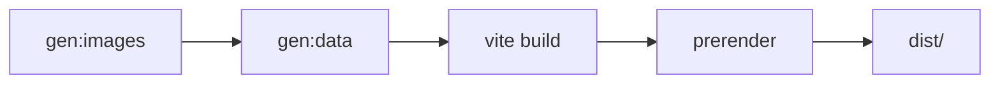
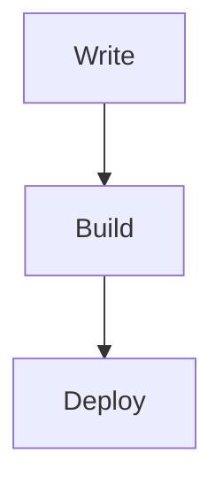

# D-blog

<div align="center">


基于 React 19 + Vite 6 + TypeScript 构建的现代化博客系统：客户端以 React SPA 运行，并在构建阶段生成站点数据、资源索引和预渲染 HTML。

**在线演示**：<https://blog.pldduck.com>

</div>

## 目录

- [核心特性](#核心特性)
- [技术栈](#技术栈)
- [快速开始](#快速开始)
- [构建流程](#构建流程)
- [项目结构](#项目结构)
- [内容管理](#内容管理)
  - [新建文章](#新建文章)
  - [文章分类](#文章分类)
  - [Markdown 增强](#markdown-增强)
  - [新建友链](#新建友链)
  - [封面生成器](#封面生成器)
  - [水印工具](#水印工具)
  - [订阅更新](#订阅更新)
- [配置指南](#配置指南)
  - [站点配置](#站点配置)
  - [赞助页面配置](#赞助页面配置)
  - [广告配置](#广告配置)
- [NPM 脚本](#npm-脚本)
- [部署指南](#部署指南)
- [贡献指南](#贡献指南)
- [许可证](#许可证)

---

## 核心特性

### 内容与写作

- **Markdown 驱动** - 使用 Markdown 文件管理内容，支持 Front Matter 元数据与多作者，分类白名单与草稿过滤在构建时校验
- **全文搜索** - 构建时生成搜索索引，前端按标题/分类/摘要/正文/标签多维度权重评分搜索，支持搜索范围筛选（标题、分类、正文内容）和搜索历史记录
- **增强渲染** - 代码高亮（highlight.js）、数学公式（KaTeX）、Mermaid 图表、GFM 表格、图片预览、DOMPurify 净化安全渲染；高亮/公式/Mermaid 按正文内容按需懒加载
- **代码块体验** - 代码块显示语言徽标、支持一键复制，超过 30 行自动折叠并可展开
- **阅读体验** - 目录导航（自动折叠非活跃分支）、阅读进度徽章、文章封面图、阅读时间与字数统计、标题锚点一键复制链接、CC BY-SA 4.0 许可声明与「帮助改进本文」入口
- **文章导航** - 上一篇/下一篇导航（`Alt + ←/→` 快捷键）、面包屑导航、多作者信息展示
- **一键分享** - 首页卡片与文章详情页均支持打开分享弹窗

### 用户体验

- **主题系统** - 浅色/深色/跟随系统三种模式，切换时支持 CSS View Transitions API 动画过渡
- **页面过渡** - 路由切换优先使用 CSS View Transitions API，兜底使用 Framer Motion 动画
- **导航体验** - 全局搜索弹窗（Windows/Linux 使用 Ctrl+K，macOS 使用 ⌘K）、响应式导航栏、移动端底部菜单（下滑手势关闭）
- **品牌加载动画** - 首次访问时显示字母打字动画 + 进度条的品牌加载效果
- **首页信息流** - 精选横版大图卡片与置顶文章、分类筛选、最新/最早排序、分页与内联全文搜索；排序和非首页页码会同步到 `sort=oldest`、`page=N`，刷新或浏览器前进/后退可恢复列表状态
- **辅助细节** - 回到顶部按钮、Cookie 隐私提示、图片渐进式加载、加载骨架屏与错误重试状态

### 性能与构建

- **预渲染** - 为每篇文章和静态页面生成独立 HTML，注入精准的 SEO meta 标签和 JSON-LD 结构化数据，并预加载文章封面图
- **代码分割** - 页面路由和部分正文能力通过动态 import 懒加载，其余模块由 Vite 默认拆分；构建时同时生成带哈希的静态资源
- **资源优化** - 构建时 esbuild 压缩与去 console/debugger、文件名哈希缓存、CSS 代码分割
- **PWA 支持** - Service Worker 缓存策略与 manifest 配置；收藏文章时缓存应用壳、文章路由和同源图片，断网后可从 IndexedDB 中读取已保存正文

### SEO 与订阅

- **自动 SEO** - 每篇文章生成 OG/Twitter Card meta、JSON-LD（Article + BreadcrumbList）结构化数据
- **RSS 订阅** - 自动生成含全文内容的 RSS 2.0 Feed
- **站点地图** - 自动生成 sitemap.xml
- **GitHub Issue 订阅** - 文章页与页脚提供订阅入口，GitHub Actions 在文章更新时自动向 Issue 发布通知（详见 [订阅更新](#订阅更新)）

### 质量保障

- **类型检查** - 使用 TypeScript 对源码进行全量类型检查，并启用未使用声明检查（`npm run typecheck`）
- **纯函数测试** - Vitest 当前覆盖阅读进度、阅读历史兼容、首页查询参数、离线记录协调和分页组件等关键逻辑（`npm run test`）；构建数据校验通过 `npm run gen:data` 执行
- **一键校验** - `npm run check` 依次执行类型检查、测试与数据生成；数据生成会写入自动生成目录，数据非法（如日期格式错误、分类不在白名单、友链 URL 无效）会直接构建报错

## 技术栈

| 技术领域 | 技术选型 |
| --- | --- |
| 前端框架 | React 19 |
| 构建工具 | Vite 6 |
| 开发语言 | TypeScript |
| 路由管理 | React Router DOM 6 |
| 样式方案 | Tailwind CSS + PostCSS |
| 动画库 | Framer Motion + CSS View Transitions API |
| Markdown 渲染 | react-markdown + remark-gfm + remark-math + rehype-highlight + rehype-katex |
| 安全净化 | DOMPurify |
| 排版增强 | @tailwindcss/typography |
| 图表渲染 | Mermaid |
| Front Matter 解析 | gray-matter |
| 环境变量 | dotenv |
| SEO 优化 | react-helmet-async |
| 图标库 | Lucide React |
| 测试框架 | Vitest |
| 代码压缩 | esbuild |
| 包管理 | npm（当前仓库未提交 lockfile，使用 `npm install` 安装依赖） |

## 快速开始

### 系统要求

- Node.js >= 20.0.0
- npm >= 10.0.0

### 安装部署

```bash
# 克隆项目
git clone https://github.com/ououduck/D-blog.git
cd D-blog

# 安装依赖（当前仓库未提交 lockfile）
npm install

# 配置环境变量（可选，用于覆盖站点 URL 和子路径）
cp .env.example .env

# 类型检查 + 测试 + 数据生成
npm run check

# 本地开发
npm run dev

# 生产构建
npm run build

# 预览构建结果
npm run preview
```

默认访问地址：<http://localhost:3000>

## 构建流程

项目采用“构建时图片处理 + 数据生成 + Vite 构建 + 预渲染”模式：


```mermaid
graph LR
  A[gen:images] --> B[gen:data]
  B --> C[vite build]
  C --> D[prerender]
  D --> E[dist/]
```

1. **图片资产生成** (`npm run gen:images`) - 扫描 `posts-img/`，先清空并重建 `public/generated-images/`，再使用 `sharp` 生成 WebP 和多种宽度的 fallback 变体，并生成 `generated/image-assets.json`。源图片不会被覆盖；该命令会改写自动生成目录。
2. **数据生成** (`npm run gen:data`) - 自动先执行图片资产生成，再读取 `posts/` 和 `friends/`，校验 Front Matter、文章 ID、图片尺寸、图片路径、标题锚点、站内链接和外链格式，生成 `generated/` 数据索引以及 `public/sitemap.xml`、`public/feed.xml`。本地图片缺失或尺寸无法读取时构建以非零状态退出；该命令同样会改写自动生成文件。
3. **Vite 构建** (`npm run build`) - 将 `src/` 编译为 `dist/` 静态资源，并复制原图与生成的响应式图片。
4. **预渲染** (`npm run prerender`) - 为每篇文章和以下静态页面生成独立的 `index.html`：`/`、`/archive`、`/tags`、`/stats`、`/about`、`/friends`、`/cover`、`/watermark`、`/sponsor`；同时注入 SEO 元数据。首屏封面 preload 使用与页面 `<picture>` 相同的 `imagesrcset`，其他图片继续原生懒加载。

文章中的站内图片推荐使用 `/posts-img/<post-id>/<filename>`；若使用文章目录下的相对路径（例如 ``），构建校验与前端会将其解析为 `/posts-img/<post-id>/diagram.png`。明确写出 `/posts-img/...` 时则按该路径处理。前端会自动选择 WebP 和合适宽度的图片。`generated/`、`public/generated-images/`、RSS 和 Sitemap 都是构建生成内容，不应手工编辑；如果本地工作树出现这些文件的变化，应在确认后再决定是否保留。

## 项目结构

```text
D-blog/
├── index.html                   # HTML 入口（字体、Clarity / Cloudflare / Umami 分析注入）
├── .env.example                 # 环境变量示例（站点 URL、子路径）
├── config/                      # 配置文件
│   ├── site.config.ts          # 站点全局配置（标题、作者、社交链接、备案等）
│   ├── content.config.json     # 文章分类白名单配置
│   ├── ads.config.ts           # 广告数据配置
│   ├── tailwind.config.js      # Tailwind CSS 配置
│   ├── postcss.config.js       # PostCSS 配置
│   └── tsconfig.json           # TypeScript 配置
├── posts/                       # Markdown 文章内容
├── posts-img/                    # 文章配图（位于仓库根目录，正文以 /posts-img/... 绝对链接引用）
├── .obsidian/                   # 本地可选 Obsidian 配置（被 Git 忽略，不随仓库提交）
├── .github/                      # GitHub 工作流
│   └── workflows/
│       └── notify-post-update.yml # 文章更新自动发布 GitHub Issue 通知
├── friends/                     # 友情链接数据（JSON）
├── generated/                   # 构建时生成的 JSON 数据（自动生成，不提交）
│   ├── posts.json              # 文章元数据
│   ├── posts-search.json       # 全文搜索索引
│   ├── image-assets.json       # 图片尺寸与响应式变体清单
│   ├── friends.json            # 友链数据
│   └── site-stats.json         # 站点统计
├── public/                      # 静态资源
│   ├── ads-img/                # 广告配图
│   ├── feed.xml                # RSS 订阅（自动生成）
│   ├── sitemap.xml             # 站点地图（自动生成）
│   ├── manifest.webmanifest    # PWA 配置清单
│   ├── sw.js                   # Service Worker
│   ├── offline.html            # 离线页面
│   ├── robots.txt              # 爬虫规则
│   ├── logo.png                # 站点 Logo
│   ├── logo-96.png             # 小尺寸 Logo
│   ├── pwa-192.png             # PWA 图标
│   ├── pwa-512.png             # PWA 图标
│   └── favicon.ico             # 站点图标
├── scripts/                     # 构建脚本
│   ├── generate-image-assets.mjs # 生成 WebP 与响应式图片变体
│   ├── generate-site-data.mjs  # 数据生成脚本（Markdown → JSON + RSS + Sitemap）
│   ├── image-assets-utils.mjs  # 图片引用解析与路径校验
│   ├── prerender.mjs           # 预渲染脚本（生成静态 HTML + SEO 标签）
│   ├── site-config-loader.mjs  # 站点配置解析（支持 VITE_SITE_URL 环境变量覆盖）
│   └── build-logger.mjs        # 构建日志输出工具
├── src/                         # 源代码
│   ├── components/             # React 组件
│   │   ├── Layout.tsx          # 布局框架（导航栏 + 搜索弹窗 + 页脚 + 主题切换）
│   │   ├── BackToTop.tsx       # 回到顶部
│   │   ├── ContentStatus.tsx   # 内容空状态 / 错误状态
│   │   ├── CookieNotice.tsx    # Cookie 通知弹窗
│   │   ├── ImageViewer.tsx     # 图片预览
│   │   ├── IssueSubscriptionCard.tsx # GitHub Issue 订阅卡片
│   │   ├── NotFoundState.tsx   # 404 状态组件
│   │   ├── ProgressiveImage.tsx # 渐进式图片加载
│   │   ├── ReadingProgressBadge.tsx # 阅读进度徽章
│   │   ├── SearchField.tsx     # 搜索输入框
│   │   ├── SearchModal.tsx     # 全局搜索弹窗（含搜索历史）
│   │   ├── Seo.tsx             # SEO meta 标签管理
│   │   ├── ShareModal.tsx      # 分享弹窗
│   │   ├── SlideModal.tsx      # 滑动弹窗
│   │   ├── TableOfContents.tsx # 文章目录导航
│   │   ├── OfflineStatus.tsx   # 离线状态提示
│   │   ├── ReadingModeContext.tsx # 专注阅读模式状态
│   │   ├── ReadingModeToggle.tsx # 专注阅读模式切换
│   │   ├── ServiceWorkerUpdatePrompt.tsx # Service Worker 更新提示
│   │   └── ui/                 # 基础 UI 组件（Surface）
│   ├── pages/                  # 页面组件（懒加载）
│   │   ├── Home.tsx            # 首页
│   │   ├── Post.tsx            # 文章详情页
│   │   ├── Archive.tsx         # 文章归档
│   │   ├── Tags.tsx            # 标签云
│   │   ├── Stats.tsx           # 站点统计（含 Umami 访问统计与 UptimeRobot 运行状态）
│   │   ├── Friends.tsx         # 友情链接
│   │   ├── About.tsx           # 关于页面
│   │   ├── CoverGenerator.tsx  # 封面生成器
│   │   ├── Watermark.tsx       # 浏览器本地水印工具
│   │   ├── Sponsor.tsx         # 赞助支持
│   │   ├── Favorites.tsx       # 离线收藏
│   │   ├── NotFound.tsx        # 404 页面
│   │   ├── archive/            # 归档相关逻辑
│   │   ├── cover/              # 封面生成核心逻辑
│   │   ├── friends/            # 友链申请生成与下载降级
│   │   └── watermark/          # 水印渲染与导出逻辑
│   ├── services/               # 数据服务层
│   │   ├── posts.ts            # 文章数据获取与全文搜索
│   │   ├── friends.ts          # 友链数据获取（随机排序）
│   │   ├── offlinePosts.ts     # 离线收藏存储
│   │   ├── readingHistory.ts   # 阅读历史存储
│   │   └── siteStats.ts        # 站点统计数据
│   ├── hooks/                  # 自定义 Hooks
│   │   ├── useMediaQuery.ts    # 响应式媒体查询
│   │   ├── useModalOverlay.ts  # 弹窗遮罩管理
│   │   ├── useOfflinePosts.ts  # 离线收藏状态
│   │   ├── useReadingHistory.ts # 阅读历史状态
│   │   └── usePostSearch.ts    # 文章搜索逻辑
│   ├── utils/                  # 工具函数
│   │   ├── date.ts             # 日期格式化
│   │   ├── headings.ts         # 标题提取工具
│   │   ├── toc.ts              # 目录树构建（自动折叠）
│   │   ├── motion.ts           # Framer Motion 动画配置
│   │   ├── preload.ts          # 页面预加载
│   │   ├── readingProgress.ts  # 阅读进度计算
│   │   ├── postRelations.ts    # 文章关联与系列导航
│   │   ├── postSorting.ts      # 文章排序
│   │   └── imageAssets.ts      # 响应式图片资源选择
│   ├── config/                 # 前端配置
│   │   └── coverTemplates.ts   # 封面模板配置
│   ├── App.tsx                 # 应用入口（路由配置 + 错误边界 + 加载动画）
│   ├── types.ts                # TypeScript 类型定义
│   ├── index.tsx               # 渲染入口
│   ├── index.css               # 全局样式（Tailwind + 自定义）
│   └── registerServiceWorker.ts # Service Worker 注册
└── vite.config.ts               # Vite 配置（别名、base path、资源映射与压缩）
```

## 内容管理

### 新建文章

在 `posts/` 目录下创建 Markdown 文件：

```yaml
---
id: my-first-post
title: 我的第一篇文章
excerpt: 文章摘要，用于列表展示和 SEO（唯一必填的摘要/描述字段）
date: 2026-03-14
updatedAt: 2026-03-20            # 可选，最后修改日期
category: 技术                    # 可选值：教程 / 技术 / 随笔 / 分享 / 其他
tags:
  - React
  - Vite
coverImage: /posts-img/example.png # 可选，封面图路径（如 /posts-img/文章id/xxx.png）
author: 跑路的duck                 # 可选，作者（字符串或对象）
featured: false                   # 是否首页精选展示
featured-top: 1                   # 精选文章置顶排序（仅 featured: true 时生效，数字越小优先级越高）
series: false                     # 是否属于文章系列
# series-name: 我的系列           # 仅 series: true 时填写
# series-order: 1                 # 仅 series: true 时填写，数字越小越靠前
draft: false                      # 是否为草稿
---

# 正文标题

这里开始写正文，支持标准 Markdown、GFM 表格、代码块等。图片 alt 必须填写非空描述；本地图片必须能解析到 `posts-img/` 内的实际文件。
```

**字段说明**：

| 字段 | 必填 | 说明 |
| --- | --- | --- |
| `id` | 是 | 文章唯一标识，对应路由 `/post/:id`，重复会构建报错 |
| `title` | 是 | 文章标题 |
| `excerpt` | 是 | 唯一的摘要/SEO 描述字段，必须是非空字符串；不使用 `description` 或 `summary` |
| `date` | 是 | 发布日期（YYYY-MM-DD），格式错误会导致构建报错 |
| `updatedAt` | 否 | 最后修改日期（YYYY-MM-DD） |
| `category` | 否 | 文章分类，必须属于 `config/content.config.json` 白名单；未填写或为空时回退为 `其他`，非空非法值会导致校验失败 |
| `tags` | 是 | 非空字符串数组；每项去除首尾空白后不得为空或重复 |
| `coverImage` | 否 | 本地路径必须指向 `posts-img/` 内的实际文件；外部封面仅允许格式正确的 HTTP(S) URL |
| `author` | 否 | 作者，支持字符串（如 `跑路的duck`）或对象（含 `name`/`avatar`/`role`/`bio`/`url`） |
| `authors` | 否 | 作者信息数组，支持多作者，每项同 `author` 对象结构 |
| `featured` | 否 | 是否作为首页精选展示 |
| `featured-top` | 否 | 精选文章置顶排序；仅 `featured: true` 时生效，数字越小优先级越高 |
| `series` | 否 | 是否属于文章系列；仅为 `true` 时才读取系列名称和章节序号 |
| `series-name` | 条件必填 | 系列名称；仅 `series: true` 时必填，`series: false` 时忽略 |
| `series-order` | 条件必填 | 系列章节序号；仅 `series: true` 时必填，必须是正整数，数字越小越靠前 |
| `draft` | 否 | 是否为草稿（`true` 时构建自动过滤） |

`id` 会作为 `/post/:id` 和站内链接的一部分使用，不能包含空白、斜杠、查询/片段分隔符、百分号、引号、尖括号或 `.`/`..` 路径段。正文中的 Markdown 图片必须有非空 `alt`；本地 `coverImage` 和正文图片（支持 query、hash、Markdown title）必须能解析到 `posts-img/` 内的实际文件，不能路径穿越。`npm run gen:data` 会检查已注册静态路由、已发布文章 ID、标题锚点和本地资源；草稿不会作为公开链接目标。普通外链只做 `http:`、`https:`、`mailto:` 格式检查，不请求网络或检查可达性。

### 文章分类

分类白名单配置在 `config/content.config.json`：

```json
{
  "postCategories": ["教程", "技术", "随笔", "分享", "其他"],
  "fallbackCategory": "其他"
}
```

- `postCategories`：合法的分类列表，文章 Front Matter 中非空的 `category` 必须在此列表中；不符合时 `npm run gen:data` 会报告校验错误
- `fallbackCategory`：未填写或空分类时的兜底值

### Markdown 增强

支持以下增强功能：

````md
# 代码高亮
```ts
console.log('hello D-blog');
```

# 数学公式
$$
E = mc^2
$$

# Mermaid 图表

```mermaid
graph TD
  A[Write] --> B[Build]
  B --> C[Deploy]
```

# GFM 表格
| 特性 | 支持 |
| --- | --- |
| 表格 | ✅ |
| 任务列表 | ✅ |
| 删除线 | ✅ |
````

### 新建友链

在友链页面展开“申请友链”，按页面中的 4 步说明在线填写申请信息，并输入一个纯英文文件名（例如 `my-blog`）：

1. 填写站点名称、简介、头像地址、站点地址和文件名。
2. 点击“完成并生成 JSON”，浏览器会下载 `my-blog.json`，并自动复制完整 JSON。
3. 在结果弹窗点击“前往发送”，收件邮箱为 `i@pldduck.com`，邮件主题必须为 `D-blog友链申请`，正文为完整 JSON。
4. 在邮件客户端中手动添加刚下载的 `.json` 文件作为附件后发送。

四个 JSON 字段均为必填，`url` 与 `avatar` 必须是合法的 HTTP(S) 链接。文件名只允许英文字母、数字、短横线和下划线，不能包含路径；缺失或重复的友链文件会在构建时被跳过并告警。

由于浏览器的 `mailto:` 协议无法可靠地自动添加附件，请务必手动添加已下载的 JSON 文件。提交前请先添加本站友链。详细流程请查看 [友链页面](https://blog.pldduck.com/friends)。

### 封面生成器

项目内置网页版封面生成器（路由 `/cover`），基于 Canvas 实时渲染，可直接下载成品：

- **背景** - 保留纯黑、纯白两种底色模板；可上传或拖入 PNG / JPEG / WebP 图片作为背景，调整透明度、模糊、缩放、水平/垂直位置，并选择铺满裁剪或完整显示
- **图片编辑** - 支持画布拖动、滚轮缩放、水平/垂直翻转、居中与参数重置，白底下可直观看到图片透明度叠加效果
- **图标** - 内置站点 Logo、上传自定义图标，或从 Iconify 在线图标库搜索选用
- **文字** - 主副标题自定义，支持字重、字号、字距、颜色、描边、阴影与自动配色
- **字体** - 支持上传自定义字体（WOFF / WOFF2 / TTF / OTF）
- **排版** - 多种布局模式（图标分割 / 堆叠 / 仅图标 / 仅文字）、文本对齐与四角、分隔线装饰
- **导出** - 提供 16:9 / 1:1 / 4:3 / 21:9 / 1.91:1（Open Graph）尺寸预设，缩放 0.5×–4×，PNG / JPEG 格式；PNG 可选择跟随模板底色或导出透明背景，JPEG 支持质量调节；下载与复制都会按目标尺寸重新渲染，而不是放大预览位图
- **可靠性** - 根据最终合成背景区域自动选择黑/白文字颜色，长标题会在安全区内缩放或截断，并通过提示播报对比度、溢出和截断诊断
- **编辑效率** - 支持 Ctrl/Cmd + Z 撤销、Shift + Z 重做、本地草稿恢复、最多 20 个持久化预设、中心线/安全框/网格辅助，以及预览聚焦后的方向键移动和 +/- 缩放
- **批量生成** - 可在导出面板上传 Markdown frontmatter、CSV 或 JSON，按 title、subtitle/description、slug 批量生成并下载 ZIP；批量处理仅在当前浏览器会话中运行，不会修改 Markdown 文件

封面模板配置位于 `src/config/coverTemplates.ts`，当前仅保留黑白两项；核心渲染逻辑位于 `src/pages/cover/`。Canvas 绘制与浏览器交互需要通过浏览器回归验证。

### 水印工具

水印工具位于 `/watermark`，所有图片处理都在浏览器 Canvas 中完成，不会把原图上传到服务器：

- 支持 PNG、JPEG、WebP、GIF 等浏览器可解码的图片格式，可批量加入图片队列并预览处理结果。
- 支持文字内容、字号、透明度、颜色、旋转、间距和九宫格位置等设置。
- 可导出 PNG 或 JPEG；透明背景等能力受浏览器 Canvas 和原图格式限制，导出前请检查预览结果。
- 资源路径通过站点 base path 处理，部署在 `/repo/` 等子路径时仍可正常加载工具资源。

### 订阅更新

站点支持通过 GitHub Issue 订阅新文章提醒：

- 文章页底部与页脚均提供**订阅**入口，点击进入 GitHub Issue 页面，点击 **Subscribe** 即可订阅更新
- 仓库内置 GitHub Actions 工作流（`.github/workflows/notify-post-update.yml`）：每当 `posts/**/*.md` 有新增或修改（且非草稿）时，自动在指定 Issue 中发布更新通知；也可通过 `workflow_dispatch` 手动指定文章文件推送通知
- 可通过仓库变量 `BLOG_NOTIFY_ISSUE_NUMBER`（默认 `6`）指定用于发布通知的 Issue 编号

## 配置指南

### 站点配置

编辑 `config/site.config.ts` 配置站点信息：

```typescript
export const siteConfig = {
  title: 'D-blog',           // 站点标题
  subtitle: '跑路的duck',    // 副标题
  description: '...',        // 站点描述
  url: 'https://...',        // 站点 URL
  social: {
    github: '...',           // GitHub 地址
    email: '...',            // 联系邮箱
  },
  author: {
    name: '跑路的duck',
    avatar: '...',           // 头像 URL
    role: '前端菜鸟',         // 身份标签
    bio: '...',              // 个人简介
  },
  beian: {
    text: '湘ICP备...',      // 备案号
    url: 'https://beian.miit.gov.cn',
  },
  friendsPage: {
    repoUrl: '...',          // 友链 PR 仓库地址
    announcement: '...',     // 友链页面顶部公告（纯文本）
  }
};
```

### 赞助页面配置

赞助页面的三种方式在 `src/pages/Sponsor.tsx` 中定义：贡献代码、提交文章和广告赞助。前两项会读取 `config/site.config.ts` 中的 GitHub 地址；广告卡片是否展示内容由 `config/ads.config.ts` 控制。

如需新增赞助方式，请在 `Sponsor.tsx` 的 `sponsorOptions` 数组中补充图标、文案和链接，并同步检查按钮可用状态。广告横幅请按下方[广告配置](#广告配置)说明添加。
### 广告配置

编辑 `config/ads.config.ts` 配置广告数据，用于在赞助页展示广告横幅。

```typescript
export const adsConfig: AdItem[] = [
  {
    id: 'tencent-cloud',           // 唯一标识
    title: '腾讯云广告',            // 广告名称
    image: '/ads-img/tencent-cloud.png', // 广告图片（放在 public/ads-img/ 下）
    link: 'https://...',           // 广告跳转链接
    alt: '腾讯云广告',              // 图片 alt 文本
    width: 984,                     // 图片固有宽度（必填）
    height: 168                     // 图片固有高度（必填）
  }
];
```

## NPM 脚本

| 命令 | 功能 |
| --- | --- |
| `npm run dev` | 启动开发服务器（端口 3000），同时执行 `gen:data` |
| `npm run build` | 生产构建：生成数据 → Vite 构建 → 预渲染 HTML |
| `npm run preview` | 预览生产构建结果 |
| `npm run gen:images` | 清空并重建响应式图片输出目录 `public/generated-images/`，同时更新图片资产清单 |
| `npm run gen:data` | 先运行 `gen:images`，再从 Markdown 生成 JSON 索引、RSS 和 Sitemap；会改写自动生成文件 |
| `npm run prerender` | 仅运行预渲染脚本，生成静态 HTML（需先 `npm run build`） |
| `npm run typecheck` | TypeScript 类型检查 |
| `npm run check` | 类型检查 + 数据生成校验（包含生成目录副作用） |

## 部署指南

### Cloudflare Pages（推荐）

| 配置项 | 值 |
| --- | --- |
| Build command | `npm run build` |
| Build output directory | `dist` |
| Node version | 20 |

在 Settings → Environment variables 中按需添加：
- `VITE_SITE_URL`：站点公开访问地址，用于生成 sitemap、RSS 和预渲染 SEO URL；未设置时使用 `config/site.config.ts` 中的 `url`
- `VITE_BASE_PATH`：站点部署在子路径时使用（如 GitHub Pages 的 `/repo/`），留空为根路径

本地可复制 `.env.example` 为 `.env`。Vite、数据生成和预渲染都会读取这些变量，因此子路径应在构建前配置完成。预渲染会为文章和静态页面写入独立 HTML；平台的 SPA fallback 仅用于未知路径或客户端路由兜底，不应覆盖已有的预渲染文件。

Service Worker 的作用域跟随部署路径，在线时按页面、静态资源和图片分别缓存。安装时会预缓存应用入口、收藏页懒加载资源及离线运行时清单；收藏文章还会等待 Worker 确认文章路由、应用壳及同源正文图片已写入缓存后才报告“可离线阅读”。断网直达 `/post/<id>` 时优先使用页面缓存，站内 SPA 路由未命中则启动缓存的应用壳，再由 IndexedDB 中保存的 Markdown 正文完成渲染。非应用路由或应用壳不可用时才显示 `offline.html`。

离线正文以 IndexedDB 为主存储；当 IndexedDB 临时不可用时，本次操作回退到 localStorage，后续操作会重新尝试并按 `id`、`savedAt` 合并迁回。localStorage 保留最近一次完整快照，避免临时故障时把待迁移记录误当成全部收藏。删除标记会阻止旧记录在数据库恢复后重新出现，迁移完成后清理对应 fallback 副本。阅读历史继续兼容旧数据，但新记录只保存文章 ID、百分比进度和更新时间，不再保存原始 `scrollTop`。

### 其他平台

**Vercel**：创建 `vercel.json`

```json
{
  "rewrites": [
    { "source": "/(.*)", "destination": "/index.html" }
  ]
}
```

**Netlify**：创建 `netlify.toml`

```toml
[[redirects]]
  from = "/*"
  to = "/index.html"
  status = 200
```

**Nginx**：配置 SPA 回退

```nginx
location / {
  try_files $uri $uri/ /index.html;
}
```

> **提示**：预渲染阶段已为每篇文章和每个静态页面生成了独立 HTML，部署时可考虑利用此特性做更精细的缓存策略。`/favorites` 只使用浏览器本地数据，预渲染页面已设置为 `noindex`。Cookie 提示当前仅记录“同意”状态，分析脚本仍按 `index.html` 的部署配置加载；如需严格的拒绝即不加载，需要额外实施 consent 门控方案。

## 贡献指南

欢迎提交 Issue 和 Pull Request！

1. Fork 本仓库
2. 创建特性分支
3. 提交更改（建议先运行 `npm run check` 通过校验）
4. 推送到分支
5. 创建 Pull Request

## 许可证

本项目采用 [MIT](./LICENSE) 许可证。

---

<div align="center">

**如果这个项目对你有帮助，欢迎 Star**

</div>
