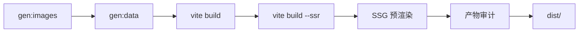
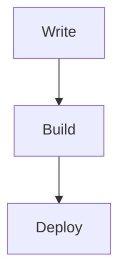

# D-blog

<div align="center">


基于 React 19 + Vite 6 + TypeScript 的静态博客：构建期生成站点数据、资源索引与全站静态 HTML（SSG），客户端以 SPA 水合运行。

**在线演示**：<https://blog.pldduck.com>

</div>

## 目录

- [核心特性](#核心特性)
- [快速开始](#快速开始)
- [构建流程](#构建流程)
- [项目结构](#项目结构)
- [内容管理](#内容管理)
- [配置指南](#配置指南)
- [NPM 脚本](#npm-脚本)
- [部署指南](#部署指南)
- [贡献指南](#贡献指南)
- [许可证](#许可证)

---

## 核心特性

### 内容与写作

- **Markdown 驱动** - 以 Markdown 管理内容，支持 Front Matter 元数据与多作者；分类白名单、草稿过滤与站内资源校验在构建时完成
- **全文搜索** - 构建时生成搜索索引，按标题/分类/摘要/正文/标签多维度权重评分，支持范围筛选与搜索历史
- **增强渲染** - 代码高亮（highlight.js）、数学公式（KaTeX）、Mermaid 图表、GFM 表格、图片预览、DOMPurify 净化；高亮/公式/Mermaid 按正文内容按需懒加载
- **阅读体验** - 目录导航（自动折叠非活跃分支）、阅读进度、封面图、阅读时间统计、标题锚点复制链接、专注阅读模式、CC BY-SA 4.0 声明与「帮助改进本文」入口
- **文章导航** - 上一篇/下一篇（`Alt + ←/→`）、系列文章、面包屑、相关文章推荐
- **一键分享** - 首页卡片与文章详情页均支持复制分享文案

### 用户体验

- **主题系统** - 浅色/深色/跟随系统三态切换，支持 CSS View Transitions 动画过渡
- **页面过渡** - 路由切换优先使用 CSS View Transitions API，兜底 Framer Motion
- **导航体验** - 全局搜索（Ctrl/⌘K）、响应式导航栏、移动端底部菜单（下滑手势关闭）
- **移动端适配** - 输入框 16px 防 iOS 聚焦缩放、导航/弹窗 safe-area 适配、矮屏横屏自动收拢浮动控件、图片预览拖拽按视口钳制
- **首页信息流** - 精选大图卡片与置顶、分类筛选、最新/最早排序、分页与内联搜索；筛选与页码同步到 URL，刷新/前进后退可恢复
- **辅助细节** - 回到顶部、Cookie 提示、图片渐进式加载、骨架屏与错误重试

### 性能与构建

- **构建期 SSG** - 为每篇文章与静态页面生成独立 HTML，注入精准 SEO meta 与 JSON-LD，预加载文章封面；客户端 `hydrateRoot` 水合
- **Suspense 展平** - SSR 序列化的隐藏占位与 `$RC` 恢复脚本在构建期就地展平为最终内容，爬虫可直接读取正文，浏览器首屏不依赖水合
- **路由数据瘦身** - 文章页内联路由数据仅当前文章携带全文，相邻/相关文章只保留元数据，控制每页 HTML 体积
- **代码分割** - 页面路由与正文能力（Mermaid / KaTeX / 代码高亮）动态 import 懒加载；构建时 esbuild 压缩并去除 console/debugger，文件名哈希缓存
- **资源优化** - LCP 封面图 `fetchpriority=high` 优先加载，其余图片原生懒加载 + WebP/多宽度 `srcset` 自适应
- **PWA 支持** - Service Worker 缓存策略与 manifest；收藏文章时缓存应用壳与路由资源，断网后可从 IndexedDB 读取已保存正文

### SEO 与订阅

- **自动 SEO** - 每页生成唯一 title/description/canonical、OG/Twitter Card、JSON-LD（WebSite + Organization + BlogPosting + BreadcrumbList），`articleBody` 输出无 Markdown 标记的纯文本
- **静态列表页** - 归档/标签/统计/友链等列表页在构建期同步注入数据，爬虫无需执行 JS 即可读取完整内容
- **canonical 策略** - 分类/标签等携带真实内容的 URL 自指 canonical；搜索页统一 `noindex,follow`，避免无限搜索 URL 收录
- **稳定 lastmod** - Sitemap 静态页 `lastmod` 取最新文章更新时间而非构建日期，避免无效重抓
- **RSS 订阅** - 自动生成含全文的 RSS 2.0 Feed 与面向 AI 智能体的 `llms.txt`
- **站点地图** - 自动生成页面/文章/图片三个 Sitemap 及索引
- **GitHub Issue 订阅** - 文章更新时由 Actions 自动向 Issue 发布通知

### 质量保障

- **类型检查** - `npm run typecheck` 全量类型检查（启用未使用声明检查）
- **构建校验** - `npm run gen:data` 验证文章元数据、站内资源与友链，非法内容直接构建失败
- **产物审计** - `npm run audit:build` 检查产物完整性、SEO 标签、静态正文与体积告警

## 技术栈

| 领域 | 选型 |
| --- | --- |
| 前端框架 | React 19 + React Router 6 |
| 构建工具 | Vite 6（客户端 + SSR 双构建） |
| 样式 | Tailwind CSS + PostCSS |
| 动画 | Framer Motion + CSS View Transitions API |
| Markdown | react-markdown + remark-gfm/math + rehype-highlight/katex |
| 安全 | DOMPurify |
| SEO | react-helmet-async + 构建期 JSON-LD |
| 其他 | Mermaid、KaTeX、highlight.js、Lucide、gray-matter、sharp、dotenv |

## 快速开始

### 系统要求

Node.js >= 20，npm >= 10。

### 安装部署

```bash
git clone https://github.com/ououduck/D-blog.git
cd D-blog

npm install

# 可选：覆盖站点 URL 与子路径
cp .env.example .env

npm run check        # 类型检查 + 数据生成校验
npm run dev          # 本地开发（默认 http://localhost:3000）
npm run build        # 生产构建（SSG 全量静态化）
npm run preview      # 预览构建产物
```

## 构建流程

构建采用“图片处理 + 数据生成 + 客户端构建 + SSR 预渲染”流水线：


```mermaid
graph LR
  A[gen:images] --> B[gen:data]
  B --> C[vite build]
  C --> D[vite build --ssr]
  D --> E[SSG 预渲染]
  E --> F[产物审计]
  F --> G[dist/]
```

1. **图片资产生成**（`gen:images`）- 扫描 `posts-img/`，用 sharp 生成 WebP 与多宽度 fallback 变体，输出 `generated/image-assets.json` 与 `public/generated-images/`。
2. **数据生成**（`gen:data`）- 校验 Front Matter、文章 ID、图片、锚点、站内/外链，生成 `generated/` 索引、`public/sitemap-*.xml`、`feed.xml`、`llms.txt`、`robots.txt`。
3. **客户端构建**（`vite build`）- 编译 `src/` 到 `dist/`，复制配图与响应式图片。
4. **SSR 构建**（`vite build --config vite.ssr.config.ts`）- 编译 `src/ssr-entry.tsx` 为 Node 可用的 SSR bundle（`dist-ssr/`）。
5. **SSG 预渲染**（`ssg`）- 用 SSR bundle 按 URL 渲染全站静态 HTML：`renderToPipeableStream` + `onAllReady` 支持 React.lazy 路由；Suspense 边界就地展平；注入 SEO meta / JSON-LD 与封面图 preload；文章正文内联进 `#ssg-route-data` 供水合复用。
6. **产物审计**（`audit:build`）- 校验 HTML 完整性、SEO 标签、静态正文与体积告警。

`generated/`、`public/generated-images/`、RSS 与 Sitemap 均为构建产物，不应手工编辑。

## 项目结构

```text
D-blog/
├── index.html                   # HTML 入口（字体、Clarity / Umami 分析注入）
├── .env.example                 # 环境变量示例（站点 URL、子路径）
├── config/                      # 配置：site.config.ts / content.config.json / ads.config.ts / tailwind / postcss / tsconfig
├── posts/                       # Markdown 文章
├── posts-img/                   # 文章配图（平铺存放，正文以 /posts-img/... 绝对链接引用）
├── friends/                     # 友链数据（JSON）
├── .pages.yml                   # PagesCMS 配置（内容模型 + 媒体路径）
├── generated/                   # 构建产物：posts.json / posts-search.json / image-assets.json / site-stats.json / friends.json
├── public/                      # 静态资源：favicon、logo、PWA 图标、sw.js、offline.html、feed.xml、sitemap-*.xml、robots.txt
├── scripts/                     # 构建脚本：generate-image-assets / generate-site-data / ssg / build / audit-build 等
├── .github/workflows/           # 文章更新通知、友链自动审核等 Actions
└── src/
    ├── components/              # Layout、Seo、TableOfContents、SearchModal、ImageViewer 等
    ├── pages/                   # 页面组件（懒加载）：Home / Post / Archive / Tags / Stats / Friends / About / Favorites 等
    ├── services/                # posts / friends / offlinePosts / readingHistory / siteStats
    ├── hooks/                   # useMediaQuery / useModalOverlay / usePostSearch 等
    ├── utils/                   # 日期、排序、目录树、站点 URL、图片资源选择等
    ├── ssr/routeData.tsx        # SSG 路由数据构造与客户端读取
    ├── App.tsx                  # 路由 + 错误边界
    └── index.tsx                # 渲染入口（水合 / 客户端渲染）
```

## 内容管理

内容通过 [PagesCMS](https://pagescms.org/) 管理——一个基于 Git 的无后端 CMS，直接读写本仓库的 Markdown 文件，无需数据库。

### 连接 PagesCMS

1. 访问 [pagescms.org](https://pagescms.org/)，授权 GitHub 并选择 D-blog 仓库
2. PagesCMS 读取根目录 `.pages.yml` 配置，自动生成文章和友链的编辑界面
3. 编辑/新建内容后保存，PagesCMS 直接提交到 GitHub 仓库，CI 自动构建部署

### 新建文章

在 PagesCMS 的「文章」集合中点击新建，填写 frontmatter 字段：

```yaml
---
id: my-first-post
title: 我的第一篇文章
excerpt: 文章摘要，用于列表展示和 SEO（必填）
date: 2026-03-14
updatedAt: 2026-03-20            # 可选，最后修改日期
category: 技术                    # 可选值：教程 / 技术 / 随笔 / 分享 / 其他
tags:
  - React
  - Vite
coverImage: /posts-img/example.png # 可选，封面图
author: 跑路的duck                 # 可选，支持对象形式
featured: false                   # 是否首页精选展示
featured-top: 1                   # 精选置顶排序（仅 featured: true 时生效）
series: false                     # 是否属于文章系列
# series-name: 我的系列           # 仅 series: true 时填写
# series-order: 1                 # 仅 series: true 时填写
draft: false                      # 草稿不会发布
---

# 正文标题

正文支持标准 Markdown、GFM 表格、代码块、数学公式与 Mermaid 图表。
```

字段规则：`id` 对应 `/post/:id`，不可含空白/斜杠等危险字符且全站唯一；`tags` 为非空去重数组；`category` 必须在 `config/content.config.json` 白名单内；正文图片必须有非空 `alt`，本地图片必须能解析到 `posts-img/` 内的实际文件。`npm run gen:data` 会在构建时校验以上全部规则，非法内容直接报错。

### 图片上传

PagesCMS 的图片媒体管理器上传的文件自动存入 `posts-img/` 目录，引用路径为 `/posts-img/<filename>.<ext>`。封面图通过 `coverImage` 字段的图片选择器上传或选取；正文图片在 rich-text 编辑器中拖放上传。

> **源码模式**：处理数学公式、Mermaid 图表、嵌套图片链接（`[](img)`）等复杂语法时，在 PagesCMS rich-text 编辑器中切换到源码模式直接编写 Markdown。

### 文章分类

白名单配置在 `config/content.config.json`：

```json
{
  "postCategories": ["教程", "技术", "随笔", "分享", "其他"],
  "fallbackCategory": "其他"
}
```

### Markdown 增强

````md
# 代码高亮
```ts
console.log('hello D-blog');
```

# 数学公式
$$
E = mc^2
$$

# Mermaid 图表

```mermaid
graph TD
  A[Write] --> B[Build]
  B --> C[Deploy]
```

# GFM 表格
| 特性 | 支持 |
| --- | --- |
| 表格 | ✅ |
| 任务列表 | ✅ |
````

### 新建友链

在友链页面展开“申请友链”，按页面步骤完成 GitHub Issue 申请：先在自己的友链页添加 D-blog 链接 → 登录 GitHub → 填写站点资料 → 生成 Issue 草稿并提交 → Actions 自动校验反链后写入 `friends/<filename>.json` 并关闭 Issue。反链要求页面公开可访问且静态 HTML 中包含 `https://blog.pldduck.com/`。

### 封面生成器与批量导出

路由 `/cover` 提供网页版封面生成器：Canvas 实时渲染，支持自定义背景/图标/文字/字体/排版，导出 16:9、1:1、4:3、21:9、1.91:1 等多种比例与 PNG/JPEG 格式；支持 Ctrl/Cmd+Z 撤销重做、草稿恢复、预设保存，以及按 Markdown/CSV/JSON 批量生成并下载 ZIP。

### 水印工具

路由 `/watermark`：所有图片处理在浏览器 Canvas 完成，不上传服务器；支持批量加水印与 PNG/JPEG 导出。

### 订阅更新

文章页底部与页脚提供**订阅**入口（GitHub Issue）。仓库内置 `notify-post-update.yml`：`posts/**/*.md` 新增或修改时自动在指定 Issue 发布通知（仓库变量 `BLOG_NOTIFY_ISSUE_NUMBER`，默认 `6`）。

## 配置指南

### 站点配置

编辑 `config/site.config.ts`：标题、描述、URL、社交链接、作者信息、友链/评论仓库、备案号等。

### 赞助与广告

赞助方式定义于 `src/pages/Sponsor.tsx`；广告横幅在 `config/ads.config.ts` 中配置（图片放 `public/ads-img/`，需注明宽高）。

## NPM 脚本

| 命令 | 功能 |
| --- | --- |
| `npm run dev` | 启动开发服务器（端口 3000），自动执行 `gen:data` |
| `npm run build` | 生产构建：图片 → 数据 → 客户端 → SSR → SSG → 审计，默认输出阶段摘要 |
| `npm run build:verbose` | 详细模式构建，保留 Vite 完整输出 |
| `npm run preview` | 预览生产构建结果 |
| `npm run gen:images` | 重建响应式图片输出与资产清单 |
| `npm run gen:data` | 数据生成 + 全量校验（改写自动生成文件） |
| `npm run ssg` | 仅执行 SSG 预渲染（需先完成两端构建） |
| `npm run typecheck` / `check` | TypeScript 类型检查 / 类型检查 + 数据校验 |

## 部署指南

### Cloudflare Pages（推荐）

| 配置项 | 值 |
| --- | --- |
| Build command | `npm run build` |
| Build output directory | `dist` |
| Node version | 20 |

环境变量（Settings → Environment variables）：

- `VITE_SITE_URL`：站点公开访问地址，用于 sitemap、RSS 与预渲染 SEO URL；未设置时使用 `config/site.config.ts`
- `VITE_BASE_PATH`：部署在子路径时使用（如 GitHub Pages 的 `/repo/`），留空为根路径

仓库通过 `public/_headers` 提供缓存策略（HTML/SW 必须 revalidate，带哈希的 JS/CSS/图片长期 immutable）。EdgeOne Pages 不读取 `_headers`，请在控制台手动配置相同策略。两个平台都不要把缺失的 `.css`/`.js`/字体请求回退到 `index.html`，否则会以错误 MIME 加载失败。

本地可复制 `.env.example` 为 `.env`；子路径应在构建前配置完成。预渲染为每篇文章与静态页面生成了独立 HTML，平台 SPA fallback 仅用于未知路径兜底。

### 其他平台

**Vercel**（`vercel.json`）：

```json
{
  "rewrites": [{ "source": "/(.*)", "destination": "/index.html" }]
}
```

**Netlify**（`netlify.toml`）：

```toml
[[redirects]]
  from = "/*"
  to = "/index.html"
  status = 200
```

**Nginx**：

```nginx
location / {
  try_files $uri $uri/ /index.html;
}
```

> Service Worker 作用域跟随部署路径，在线时按页面/静态资源/图片分别缓存；断网直达 `/post/<id>` 优先页面缓存，SPA 路由未命中则启动应用壳并从 IndexedDB 渲染已保存正文，应用壳不可用时才显示 `offline.html`。`/favorites` 仅使用浏览器本地数据，已 `noindex`。

## 贡献指南

欢迎提交 Issue 和 PR：Fork → 创建特性分支 → `npm run check` 通过校验 → 提交 PR。

## 许可证

本项目采用 [MIT](./LICENSE) 许可证。
