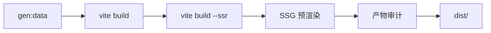
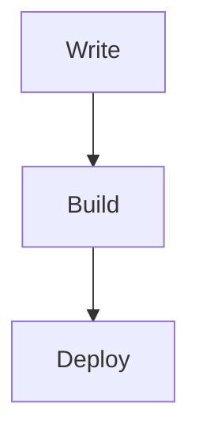

# D-blog

<div align="center">


基于 React 19 + Vite 6 + TypeScript 的静态博客：构建期生成站点数据与全站静态 HTML（SSG），客户端以 SPA 水合运行。

**在线演示**：<https://blog.pldduck.com>

</div>

## 核心特性

- **Markdown 驱动** — Front Matter 元数据、多作者、分类白名单与草稿过滤均在构建时校验
- **增强渲染** — 代码高亮（diff 块 `+`/`-`/`@@` 整行高亮）、代码块文件名（```` ```ts title="app.ts" ````）、长代码自动折叠、行号点击复制单行、长行自动换行开关；KaTeX 数学公式、Mermaid 图表、GFM 表格、图片预览、DOMPurify 净化；高亮/公式/Mermaid 按正文内容按需懒加载
- **全文搜索** — 构建时生成搜索索引，多维度权重评分，支持范围筛选与搜索历史
- **阅读体验** — 目录导航（自动折叠非活跃分支）、阅读进度恢复、专注阅读模式、深色模式图片自动柔和降亮（可单图豁免）、CC BY-SA 4.0 声明、标题锚点复制链接
- **分享与互动** — 分享弹窗支持一键复制文案/链接，并可生成含封面、标题与二维码的竖版分享海报（Canvas 本地绘制，无外链依赖）；Giscus 评论区懒加载（滚动到评论区附近才注入，不拖慢正文阅读）；独立留言板页（`/guestbook`）绑定仓库固定 Discussion，与文章评论共用 Akismet 反垃圾
- **文章导航** — 上一篇/下一篇（`Alt + ←/→`）、系列文章、面包屑、相关文章推荐
- **主题系统** — 浅色/深色/跟随系统三态切换，支持 CSS View Transitions 过渡
- **首页信息流** — 精选大图卡片与置顶、分类筛选、排序、分页与内联搜索；筛选与页码同步到 URL
- **构建期 SSG** — 每篇文章与静态页面生成独立 HTML，注入精准 SEO meta 与 JSON-LD；Suspense 边界就地展平，爬虫可直接读取正文
- **代码分割** — 页面路由与正文能力动态 import 懒加载；厂商代码分块（framer-motion / react-dom / react-router）
- **PWA** — Service Worker 缓存策略 + manifest；收藏文章断网后可从 IndexedDB 离线阅读
- **SEO 与订阅** — 自动生成 OG/Twitter Card、JSON-LD（WebSite + Organization + BlogPosting + BreadcrumbList + CollectionPage）、hreflang 语言自引用、RSS 2.0 Feed、`llms.txt`、Sitemap（页面/文章/图片含图床外链）、`robots.txt`
- **质量保障** — `npm run typecheck` 全量类型检查（含未使用声明检查）；`npm run gen:data` 构建时校验文章元数据与站内资源；`npm run audit:build` 产物完整性审计；`npm run audit:seo` 大厂级 SEO 清单审计（已接入 `npm run build` 流水线）

## 技术栈

| 领域 | 选型 |
| --- | --- |
| 前端框架 | React 19 + React Router 6 |
| 构建工具 | Vite 6（客户端 + SSR 双构建） |
| 样式 | Tailwind CSS + PostCSS |
| 动画 | Framer Motion + CSS View Transitions API |
| Markdown | react-markdown + remark-gfm/math + rehype-highlight/katex |
| 安全 | DOMPurify |
| 其他 | Mermaid、KaTeX、highlight.js、Lucide、gray-matter、sharp、dotenv |

## 快速开始

```bash
git clone https://github.com/ououduck/D-blog.git
cd D-blog
npm install
cp .env.example .env          # 可选：覆盖站点 URL 与子路径
npm run check                 # 类型检查 + 数据生成校验
npm run dev                   # 本地开发（http://localhost:3000）
npm run build                 # 生产构建（SSG 全量静态化）
npm run preview               # 预览构建产物
```

Node.js >= 20，npm >= 10。

## 构建流程


```mermaid
graph LR
  A[gen:data] --> B[vite build]
  B --> C[vite build --ssr]
  C --> D[SSG 预渲染]
  D --> E[产物审计]
  E --> F[dist/]
```

1. **数据生成**（`gen:data`）— 校验 Front Matter、文章 ID、图片、锚点与链接，生成 `generated/` 索引、Sitemap、RSS、`llms.txt`、`robots.txt`
2. **客户端构建**（`vite build`）— 编译 `src/` 到 `dist/`
3. **SSR 构建**（`vite build --ssr`）— 编译 SSR bundle 到 `dist-ssr/`
4. **SSG 预渲染**（`ssg`）— 用 SSR bundle 按路由渲染全站静态 HTML：Suspense 展平、注入 SEO meta / JSON-LD 与封面 preload
5. **产物审计**（`audit:build`）— 校验 HTML 完整性、SEO 标签、静态正文与体积

`generated/`、RSS 与 Sitemap 均为构建产物，不应手工编辑。

## 项目结构

```text
D-blog/
├── index.html               # HTML 入口（字体、Clarity 注入与不蒜子预连接）
├── .env.example             # 环境变量示例
├── config/                  # site.config.ts / content.config.json / ads.config.ts / tsconfig
├── posts/                   # Markdown 文章
├── friends/                # 友链数据（JSON）
├── .pages.yml               # PagesCMS 配置
├── generated/               # 构建产物：posts.json / posts-search.json / site-stats.json / friends.json
├── public/                  # 静态资源：favicon、PWA 图标、sw.js、offline.html、feed.xml、sitemap
├── scripts/                 # 构建脚本：generate-site-data / ssg / build / audit-build 等
├── .github/workflows/       # 文章更新通知、友链自动审核、评论检查
└── src/
    ├── components/          # Layout、Seo、TableOfContents、SearchModal、ImageViewer 等
    ├── pages/               # 页面组件（懒加载）
    ├── services/            # posts / friends / offlinePosts / readingHistory / siteStats / busuanzi
    ├── hooks/               # useMediaQuery / useModalOverlay / usePostSearch 等
    ├── utils/               # 日期、排序、目录树、站点 URL、动画等
    ├── ssr/routeData.tsx    # SSG 路由数据构造与客户端读取
    ├── App.tsx              # 路由 + 错误边界
    └── index.tsx            # 渲染入口（水合 / 客户端渲染）
```

## 内容管理

内容通过 [PagesCMS](https://pagescms.org/) 管理——基于 Git 的无后端 CMS，直接读写本仓库的 Markdown 文件。

### 新建文章

在 PagesCMS「文章」集合中点击新建，填写 frontmatter：

```yaml
---
id: my-first-post             # 对应 /post/:id，全站唯一，不可含空白/斜杠
title: 我的第一篇文章
excerpt: 文章摘要，用于列表展示和 SEO（必填）
date: 2026-03-14
updatedAt: 2026-03-20         # 可选
category: 技术                 # 必须在 content.config.json 白名单内
tags: [React, Vite]
coverImage: https://cdn.example.com/cover.png  # 可选，图床链接
author: 跑路的duck             # 可选，支持对象形式
featured: false               # 首页精选展示
featured-top: 1              # 精选置顶排序（仅 featured: true 时生效）
series: false                # 是否属于文章系列（series-name / series-order 配套）
draft: false                  # 草稿不会发布
---
```

正文支持标准 Markdown、GFM 表格、代码高亮、数学公式与 Mermaid 图表。`npm run gen:data` 会在构建时校验全部规则，非法内容直接报错。

### 图片管理

封面与正文图片均通过图床（PicGo）托管，直接在 `coverImage` 字段粘贴链接，正文图片以 `` 形式插入。批量迁移本地图片可运行 `npm run migrate:images`（支持 `--dry-run`）。

### Markdown 增强

````md
```ts
console.log('hello D-blog');
```

$$ 
E = mc^2
$$


```mermaid
graph TD
  A[Write] --> B[Build]
  B --> C[Deploy]
```
````

代码块支持以下增强写法：

````md
<!-- 文件名：显示在代码块工具栏，下载时也以此命名 -->
```ts title="utils/format.ts"
export const format = (value: string) => value.trim();
```

<!-- diff：+ / - / @@ 行自动整行高亮 -->
```diff
- const oldValue = 1;
+ const newValue = 2;
```

<!-- 深色模式图片豁免：默认正文图片在暗色下会柔和降亮，深色截图可豁免 -->

````

正文图片在深色模式下会自动柔和降亮（悬停恢复原亮度）；如需单图豁免，在标题位置写 `"no-dark"`（如上）。长代码块默认折叠为 30 行，可展开；工具栏提供「自动换行」开关，点击行号可复制该行代码。

### 友链申请

在友链页面展开「申请友链」，按步骤完成 GitHub Issue 申请：先在自己友链页添加 D-blog 链接 → 登录 GitHub → 填写站点资料 → 提交 Issue → Actions 自动校验反链后写入 `friends/` 并关闭 Issue。

### 留言板

`/guestbook` 留言板页通过 Giscus `mapping=number` 固定指向仓库的「D-blog 留言板」Discussion（[discussions/9](https://github.com/ououduck/D-blog/discussions/9)，「留言板」分类），所有留言汇聚到同一线程；配置位于 `config/site.config.ts` 的 `guestbook.discussionId`。留言数据存于本仓库 Discussions，与文章评论共用 Akismet 反垃圾（`akismet-discussion-comment-check.yml`），并叠加自建关键词过滤（`comment-keyword-filter.yml`，关键词配置见 `config/comment-keywords.json`）作为审核层。

### 订阅更新

仓库内置 `notify-post-update.yml`：`posts/**/*.md` 新增或修改时自动在指定 Issue 发布通知（仓库变量 `BLOG_NOTIFY_ISSUE_NUMBER`，默认 `6`）。

## 配置

- **站点配置**：`config/site.config.ts` — 标题、描述、URL、社交链接、作者信息、备案号等
- **赞助与广告**：赞助方式定义于 `src/pages/Sponsor.tsx`；广告横幅在 `config/ads.config.ts` 配置（图片放 `public/ads-img/`）
- **文章分类白名单**：`config/content.config.json` 的 `postCategories` 数组

## NPM 脚本

| 命令 | 功能 |
| --- | --- |
| `npm run dev` | 启动开发服务器（端口 3000），自动执行 `gen:data` |
| `npm run build` | 生产构建：数据 → 客户端 → SSR → SSG → 审计 |
| `npm run build:verbose` | 详细模式构建，保留 Vite 完整输出 |
| `npm run preview` | 预览生产构建结果 |
| `npm run migrate:images` | 批量迁移本地图片至图床（支持 `--dry-run`） |
| `npm run gen:data` | 数据生成 + 全量校验 |
| `npm run ssg` | 仅执行 SSG 预渲染（需先完成两端构建） |
| `npm run audit:build` | 构建产物完整性审计（HTML / SEO 标签 / 体积） |
| `npm run audit:seo` | 大厂级 SEO 清单审计（26 页 × 16 项检查，已接入 build） |
| `npm run typecheck` / `check` | TypeScript 类型检查 / 类型检查 + 数据校验 |

## 部署

采用 **GitHub Actions 构建 + 双平台直传**：构建在 GitHub 完成（公开仓库 Actions 免费无限额度），产物直传 Cloudflare Pages 与 EdgeOne Pages，两个平台均不消耗构建额度。日常 push 到 main 不会触发任何部署，只有手动触发才会构建。

### 触发方式

1. **Pages CMS**：侧边栏「🚀 部署到 Cloudflare & EdgeOne」按钮（配置见 `.pages.yml` 的 `actions` 段），点击后自动触发 GitHub Actions 构建并部署；
2. **GitHub Actions 页面**：手动 Run workflow（`deploy.yml`，payload 最小可用 `{"repository":{"ref":"main"}}`）。

### 一次性前置配置

| 项 | 说明 |
| --- | --- |
| Cloudflare Pages | 项目类型为 **Direct Upload**（直传），自定义域名与缓存策略（`public/_headers`）已就位 |
| EdgeOne Pages | 项目类型为 **直传（Direct Upload）**（EdgeOne CLI 仅支持直传类型项目），域名 CNAME 已切换，缓存规则需在控制台手动配置（EdgeOne 不读 `_headers`） |
| 仓库 Secrets | `CLOUDFLARE_API_TOKEN`（Pages:Edit 权限）、`CLOUDFLARE_ACCOUNT_ID`、`EDGEONE_API_TOKEN` |

### 构建与部署流程

`deploy.yml`：按 CMS 当前分支检出 → `npm ci` 安装依赖 → `npm run build`（输出 `dist/`）→ wrangler 直传 Cloudflare Pages → EdgeOne CLI 直传 EdgeOne Pages。

> 两个平台的项目名均为 `d-blog`（直传类型），已在 `deploy.yml` 中配置；若平台项目名不同，修改 `--project-name` / `-n` 参数即可。

环境变量：`VITE_SITE_URL`（站点公开访问地址）、`VITE_BASE_PATH`（子路径部署时使用，留空为根路径）。

### 其他平台

SPA fallback 配置（未知路径回退到 `index.html`）：

```json
// Vercel (vercel.json)
{ "rewrites": [{ "source": "/(.*)", "destination": "/index.html" }] }
```

```toml
# Netlify (netlify.toml)
[[redirects]]
  from = "/*"
  to = "/index.html"
  status = 200
```

```nginx
# Nginx
location / { try_files $uri $uri/ /index.html; }
```

Service Worker 作用域跟随部署路径，在线时按页面/静态资源/图片分别缓存；断网直达 `/post/<id>` 优先页面缓存，SPA 路由未命中则启动应用壳并从 IndexedDB 渲染已保存正文。

## 贡献指南

欢迎提交 Issue 和 PR：Fork → 创建特性分支 → `npm run check` 通过校验 → 提交 PR。

## 许可证

[MIT](./LICENSE)
