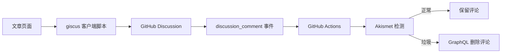

# 使用 giscus 和 akismet 实现静态博客评论及垃圾审查功能

静态博客的优点是部署简单、访问速度快，也不需要维护数据库和后端服务。不过，评论功能往往会把问题带回来：评论数据放在哪里？访客如何登录？垃圾评论如何处理？如果为这些问题单独搭建一套服务，系统复杂度很快就会超过博客本身。

`giscus` 提供了一个轻量的解决方案：它使用 GitHub Discussions 保存评论，博客只需要加载一段客户端脚本。再配合 `Akismet` 和 GitHub Actions，就可以在评论创建后自动进行垃圾检测，并删除被判定为垃圾的评论。

这套方案适合源码托管在 GitHub、文章以 Markdown 管理的个人静态博客。评论的存储、登录和通知由 GitHub 负责，垃圾审核交给 Action 执行，博客本身不需要增加评论后端。

## 工作原理

评论系统由三个部分组成：

1. `giscus` 把网页评论映射到 GitHub Discussions。
2. GitHub Discussion 负责保存评论，并提供 GitHub 登录能力。
3. `discussion_comment` 事件触发 GitHub Actions，Action 将评论内容提交给 Akismet；如果返回垃圾评论结果，则通过 GraphQL 删除评论。



## 配置 giscus

### 1. 准备 GitHub 仓库

首先准备一个**公开的 GitHub 仓库**作为评论仓库。可以直接使用博客源码仓库，也可以创建一个单独的空仓库。评论仓库需要开启 GitHub Discussions 功能：

1. 打开仓库的 `Settings`。
2. 在 `Features` 中启用 `Discussions`。
3. 创建一个用于评论的分类，例如 `Announcements`。


### 2. 在 giscus 中生成配置

打开 [giscus 中文配置页面](https://giscus.app/zh-CN)，填写仓库名称并完成检查。随后选择评论映射方式。


最推荐使用 `pathname` 映射。假设文章地址是 `/post/hello-world`，只要这个路径保持不变，评论就会一直关联到同一个 Discussion。

常见映射方式的区别如下：

| 映射方式 | 关联依据 | 需要注意的问题 |
| --- | --- | --- |
| `pathname` | 页面路径 | 推荐，域名变化不会影响评论关联 |
| `url` | 完整 URL | 更换域名后可能无法命中原评论 |
| `title` | 文章标题 | 修改标题后可能产生新的评论串 |


建议同时开启严格匹配。严格匹配会为页面和 Discussion 建立额外的哈希标识，可以降低不同页面评论串台的概率。


如果需要把页面重新映射到一个已经存在的 Discussion，可以根据 giscus 生成的页面标识计算 SHA-1，然后把对应标识写入目标 Discussion 的正文。一般情况下不需要手动处理，首次加载时让 giscus 自动创建即可。

### 3. 选择分类和功能

评论分类可以选择 `Announcements`（公告）等适合公开讨论的分类。表情反应、输入框位置、语言和主题根据博客需要选择。


生成的脚本大致如下：

```html
<script src="https://giscus.app/client.js"
        data-repo="OWNER/REPOSITORY"
        data-repo-id="REPOSITORY_ID"
        data-category="Announcements"
        data-category-id="CATEGORY_ID"
        data-mapping="pathname"
        data-strict="1"
        data-reactions-enabled="1"
        data-emit-metadata="0"
        data-input-position="top"
        data-theme="preferred_color_scheme"
        data-lang="zh-CN"
        data-loading="lazy"
        crossorigin="anonymous"
        async>
</script>
```

把脚本放在文章正文下方的评论区容器中即可。React、Vue 或其他前端框架项目应在组件挂载后创建脚本，避免 SSR 阶段访问 `document`。

对于 SPA，还要注意两个问题：切换文章时需要重新加载脚本，让 giscus 读取新的 `pathname`；站点切换深浅主题时，需要向 giscus iframe 发送主题更新消息，不能只在首次加载时设置主题。


## 配置 Akismet

### 1. 获取 API Key

打开 [Akismet 官网](https://akismet.com/) 注册账号，选择适合个人博客的订阅方案。个人方案可以将价格调整为 `$0`，完成注册后在账户页面获取 Akismet API Key。


Akismet 的检测接口会接收评论作者、评论内容、来源页面等信息，并返回 `true` 或 `false`。`true` 表示 Akismet 认为评论是垃圾内容，`false` 表示评论可以保留。

### 2. 创建 GitHub Token

Action 需要删除 Discussion 评论，因此默认的 `GITHUB_TOKEN` 可能不一定满足仓库权限要求。可以在 [GitHub Token 设置页面](https://github.com/settings/tokens) 创建一个专用令牌，并按照实际仓库设置授予必要的 Discussions 写权限。

令牌应保存为仓库 Secret，例如：

- `AKISMET_API_KEY`：Akismet API Key。
- `GH_TOKEN`：用于调用 GitHub GraphQL API 的令牌。

不要把这两个值直接写进 workflow 文件，也不要在日志中输出完整令牌。


## 创建垃圾评论检测 Action

在启用了 giscus 的仓库中创建 `.github/workflows/akismet-discussion-comment-check.yml`：

```yaml
name: Akismet Discussion Comment Checker

on:
  discussion_comment:
    types: [created]

permissions:
  contents: read
  discussions: write

jobs:
  check-akismet:
    runs-on: ubuntu-latest
    steps:
      - name: Check and delete spam comments
        uses: actions/github-script@v8
        env:
          AKISMET_API_KEY: ${{ secrets.AKISMET_API_KEY }}
        with:
          github-token: ${{ secrets.GH_TOKEN }}
          script: |
            const apiKey = process.env.AKISMET_API_KEY;
            const comment = context.payload.comment;
            const discussion = context.payload.discussion;
            const repository = context.payload.repository;

            const params = new URLSearchParams({
              blog: repository.html_url,
              user_ip: '127.0.0.1',
              user_agent: 'D-blog Akismet Action/1.0',
              referrer: discussion.html_url,
              comment_type: 'comment',
              comment_author: comment.user.login,
              comment_author_url: comment.user.html_url,
              comment_content: comment.body,
            });

            const response = await fetch(
              `https://${apiKey}.rest.akismet.com/1.1/comment-check`,
              {
                method: 'POST',
                headers: {
                  'Content-Type': 'application/x-www-form-urlencoded',
                  'User-Agent': 'D-blog Akismet Action/1.0',
                },
                body: params,
              },
            );
            const result = (await response.text()).trim();

            if (!response.ok || !['true', 'false'].includes(result)) {
              core.setFailed(`Akismet returned HTTP ${response.status}`);
              return;
            }

            if (result === 'true') {
              await github.graphql(
                `mutation DeleteDiscussionComment($commentId: ID!) {
                  deleteDiscussionComment(input: { id: $commentId }) {
                    clientMutationId
                  }
                }`,
                { commentId: comment.node_id },
              );
              core.info('Spam comment deleted.');
            }
```

这个 workflow 的关键点有三个：

1. 监听 `discussion_comment.created`，只在新评论产生时执行。
2. 使用 `github-script` 直接读取事件对象，评论中的换行、引号和特殊字符不会破坏 shell 命令。
3. 删除评论使用 GraphQL 的 `deleteDiscussionComment` mutation，因为 giscus 评论对应的是 Discussion comment，而不是普通 Issue comment。


## 测试垃圾评论检测

完成配置后，可以发布一条测试评论验证流程。Akismet 提供了专门的测试字符串：

```text
viagra-test-123
```

这条评论应当被判定为垃圾评论。发布后进入仓库的 `Actions` 页面，检查 workflow 是否成功运行，并确认评论是否被删除。


测试完成后不要继续保留测试评论，也不要在生产环境中把测试字符串当作普通内容使用。

## 处理持续刷屏的用户

Akismet 适合处理自动化垃圾内容，但它不是完整的社区管理系统。如果某个用户持续发布刷屏内容，可以在 GitHub 中打开该用户的个人资料页，手动阻止用户。

具体操作可以参考 GitHub 文档：[阻止用户访问您的个人帐户](https://docs.github.com/zh/communities/maintaining-your-safety-on-github/blocking-a-user-from-your-personal-account#blocking-a-user-from-their-profile-page)。

## 防止新用户刷评论

如果垃圾评论来自大量新注册账号，可以配置仓库的交互限制：

```text
https://github.com/你的用户名/你的仓库/settings/interaction_limits
```

根据博客的访问情况，可以临时限制新用户创建 Discussion、发表评论或进行其他交互。限制不应长期设置得过于严格，否则可能误伤正常读者。

## 注意事项

这套方案虽然简单，但仍有几个边界需要提前了解：

- giscus 依赖 GitHub，GitHub 登录或 Discussions 服务异常时，评论区也会受到影响。
- `pathname` 是评论关联的关键，文章 ID 和文章路径不应随意修改。
- Action 删除评论需要足够的 Discussions 写权限，Secret 令牌应使用最小必要权限。
- Akismet 的判断结果不是绝对准确，重要博客仍应保留人工复核能力。
- 不要在 workflow 日志中打印评论正文、API Key 或完整 GitHub Token。
- 评论区脚本来自第三方服务，应在站点隐私政策和 Cookie 策略中说明相关数据处理方式。

## 总结

对于使用 GitHub 托管源码的静态博客，giscus 可以用很低的接入成本提供完整的评论体验，Akismet 则负责过滤常见的垃圾内容。两者结合后，博客不需要搭建数据库、用户系统或单独的评论后端，就能拥有 GitHub 登录、Discussion 存储、评论通知和自动垃圾审查功能。

本文参考并沿用了[二叉树树博客原文章](https://2x.nz/posts/giscus-akismet)的配图。
此外，请注意，本文采用了AI润色，请注意辨别。
