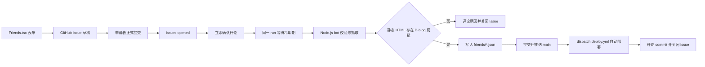

# 用 GitHub Actions 实现友链申请自动审核

友情链接看起来只是几个 JSON 文件，但一次完整的申请通常包含很多重复工作：收集站点名称和头像，确认对方已经添加本站链接，打开对方页面检查反链，再手动创建文件、提交代码并回复申请者。申请数量少时，这些工作还能接受；一旦博客开始有稳定访问量，审核就会变成一项需要反复切换页面的维护任务。

这篇文章记录 D-blog 如何把这条链路交给 GitHub Issue 和 GitHub Actions：申请者在网页填写资料，网站生成一个预填好的 Issue 草稿；申请者在 GitHub 中确认并正式提交后，Action 先评论收件结果，等待一段时间再检查反链。通过审核后，Action 自动把友链写入 `friends/` 目录、推送代码并触发部署。

整个过程不需要自建后端，也不需要 SMTP、Resend 或个人 GitHub Token。GitHub Issue 负责保存公开申请记录，GitHub Actions 负责运行校验脚本和提交数据。

## 最终效果

申请者看到的是一个普通的网页表单，但后台实际经过以下步骤：

1. 申请者先在自己的公开友链页加入 D-blog。
2. 在 `/friends` 页面点击“登录 GitHub”，填写站点资料和友链页地址。
3. 页面生成一个标题以 `[Friend Link]` 开头的 GitHub Issue 草稿。
4. 申请者在 GitHub 页面检查内容，点击 `Submit new issue` 正式提交。
5. `issues.opened` 事件触发 Action，bot 立即评论“已收到申请”。
6. 同一个 run 原地等待新申请满 10 分钟冷却期（让对方的部署和 CDN 缓存有时间生效）。
7. bot 重新校验字段、公开 URL 和文件名，再请求友链页检查 D-blog 反链。
8. 检查通过后生成 `friends/<filename>.json`，以 `github-actions[bot]` 身份提交并推送到 `main`。
9. bot 触发部署工作流，让新友链自动上线。
10. bot 在 Issue 中评论结果，并将成功申请关闭为 `completed`，失败申请关闭为 `not_planned`。

整个流程是事件驱动的：没有申请提交时，工作流一次都不会运行。申请通常在提交后的 10 至 15 分钟内完成处理。

## 为什么选择 Issue 和 Actions

友链申请不需要复杂的用户系统。申请内容本来就适合公开讨论，而 GitHub 已经提供了 Issue、评论、通知、权限和审计记录。把这些能力组合起来，可以避免为一个小型博客额外维护 API、数据库和邮件服务。

| 方案 | 优点 | 限制 |
| --- | --- | --- |
| GitHub Issue + Actions | 无需自建后端，申请记录公开，校验和提交自动完成 | 申请者需要 GitHub 账号，提交后需等待约 10 至 15 分钟 |
| 普通网页表单 | 使用门槛低，界面完全可控 | 仍需要后端、存储和通知机制 |
| Pull Request | 变更可审查，适合严格维护分支 | 申请者操作复杂，审核流程更重 |
| 邮件申请 | 用户熟悉，沟通直接 | 需要处理垃圾邮件、附件解析、回复和人工落库 |
| 第三方表单服务 | 上线快，常带有管理后台 | 引入外部依赖，自动写回仓库仍需额外授权 |

这个方案并不意味着所有友链都应该自动通过。自动化的重点是把重复、明确、可验证的步骤交给脚本；对于需要人工判断的特殊情况，仍然可以在 Issue 中人工处理或修改 workflow。

## 工作原理

D-blog 的友链源数据保存在 `friends/*.json` 中，构建阶段由 `scripts/generate-site-data.mjs` 汇总成前端读取的 `generated/friends.json`。因此 bot 不需要调用站点接口，只要成功写入一个合法的 JSON 文件，下一次部署就能展示新友链。



这里有一个重要的职责边界：浏览器不直接提交申请，也不持有仓库写权限。网页只负责校验输入并打开 GitHub 的预填 Issue URL；真正拥有写仓库权限的只有 GitHub Actions 中的 `GITHUB_TOKEN`。

## 两阶段审核：先确认、后复核

如果在 `issues.opened` 事件中立刻抓取友链页，申请者可能刚提交表单，还没来得及完成部署或 CDN 缓存刷新，审核就会得到错误结果。因此当前 workflow 把处理拆成两个阶段，但放在同一个 run 里完成。

第一阶段监听 Issue 打开事件，立即发布一条确认评论，让申请者马上知道申请已被接收：

```yaml
on:
  issues:
    types: [opened]
```

第二阶段不依赖定时任务，而是在同一个 run 中原地等待冷却期：新申请的创建时间未满 10 分钟时，`review` 模式先等待剩余冷却时间，再重新拉取开放 Issue 并逐个审核。

```js
export const WAIT_MS = 10 * 60 * 1000;

// review 模式：等待所有待审申请中剩余冷却时间的最大值
const waitMs = Math.min(MAX_COOLDOWN_WAIT_MS, computeCooldownWaitMs(pending));
if (waitMs > 0) await sleep(waitMs);
```

冷却等待有 12 分钟封顶（低于 workflow 的 `timeout-minutes: 15`），避免设置被调大时 job 在等待期间被超时终止；超出封顶的申请会由冷却检查跳过，留待下一次事件或手动运行处理。

选择事件驱动而不是 `schedule` 定时扫描，主要有三个原因：

- **零空闲运行**：没有申请时 workflow 完全不执行，公开仓库不消耗 Actions 额度，私有仓库也不会因为每 5 分钟一次的轮询白白扣减分钟数。
- **无调度延迟**：GitHub 的 `schedule` 由平台调度，繁忙时可能延迟数十分钟；事件驱动的 run 在提交瞬间触发，处理时间更可预期。
- **单 run 闭环**：确认评论、冷却等待、审核、提交、部署全部在一个 run 内完成，日志连贯，排查也方便。

## 第一步：在前端生成标准 Issue

友链页面的表单位于 `src/pages/Friends.tsx`，字段定义和校验集中在 `src/pages/friends/friendLinkApplication.ts`。当前申请需要以下信息：

- `Site Name`：站点名称。
- `Short Description`：站点简介。
- `Avatar URL`：头像地址。
- `Site URL`：站点主页。
- `Friend Page URL`：包含 D-blog 反链的友链页。
- `Your Name / Contact`：称呼或联系方式。
- `Filename`：写入 `friends/` 目录的文件名。

页面还要求勾选“我已经先在自己的博客友链页加入 D-blog”。这个复选框不能代替服务端检测，但能在提交前提醒申请者完成前置条件。

表单通过固定的英文标签生成正文：

```md
## Friend Link Application

- Site Name: Demo Blog
- Site URL: https://example.com
- Friend Page URL: https://example.com/friends
- Avatar URL: https://example.com/avatar.png
- Short Description: A demo site
- Your Name / Contact: @demo
- Filename: demo-blog.json
- Reciprocal Link Added: yes
```

标题使用统一前缀：

```text
[Friend Link] Demo Blog
```

固定字段的好处是 bot 不需要猜测自然语言。网页上的“生成 GitHub Issue 草稿”只会打开 GitHub 的 `issues/new` URL，并不会创建 Issue。申请者必须在 GitHub 中确认预填内容，再点击 `Submit new issue`，提交后的 `issues.opened` 才会触发审核。

## 第二步：配置 GitHub Actions

D-blog 使用 `.github/workflows/friend-link-bot.yml`，同时支持自动事件和手动运行：

```yaml
name: Friend Link Bot

on:
  issues:
    types: [opened]
  workflow_dispatch:

permissions:
  contents: write
  issues: write
  # 审核通过后需显式 dispatch deploy.yml 触发构建部署（GITHUB_TOKEN 的
  # push 不会触发任何 workflow，workflow_dispatch 是少数可由 GITHUB_TOKEN
  # 触发的例外），因此需要 actions: write。
  actions: write

concurrency:
  # 事件驱动（无定时轮询）：仅在有人提交友链申请（或手动 dispatch）时运行，
  # 平时零运行。group 固定保证同时至多一个 job（issues:opened 只投递一次，
  # 排队不取消，取消即永久丢失"已收到"回复）。
  group: friend-link-bot
  cancel-in-progress: false

jobs:
  process:
    if: github.event_name != 'issues' || startsWith(github.event.issue.title, '[Friend Link]')
    runs-on: ubuntu-latest
    # 事件驱动下的长运行：issues:opened 触发的 run 内 review 模式会原地等待
    # 冷却期（新申请提交满 10 分钟才审核，最多等 ~10 分钟）+ 审核处理，
    # 15 分钟封顶保证长运行不失控。（无此字段时默认 6 小时。）
    timeout-minutes: 15
    steps:
      - name: Check out repository
        uses: actions/checkout@v4
        with:
          # 完整历史：commitAndPushFriendFile 的 push 需要本地 HEAD 与远端一致，
          # fetch-depth: 0 避免浅克隆 push 失败。
          fetch-depth: 0

      - name: Confirm friend-link application received
        if: github.event_name == 'issues'
        env:
          GITHUB_TOKEN: ${{ secrets.GITHUB_TOKEN }}
          GITHUB_REPOSITORY: ${{ github.repository }}
          ISSUE_PAYLOAD: ${{ toJson(github.event.issue) }}
        run: node scripts/friend-link-bot.mjs opened

      - name: Review friend-link applications
        # always()：即使上一步回执失败（如限流）也不阻断审核主流程。
        if: always()
        env:
          GITHUB_TOKEN: ${{ secrets.GITHUB_TOKEN }}
          GITHUB_REPOSITORY: ${{ github.repository }}
          # 事件驱动 + 原地冷却：issues:opened 触发的 run 置 1，review 模式
          # 等待新申请冷却完成后本 run 内审核；手动 dispatch 留空不等待。
          FRIEND_LINK_WAIT_COOLDOWN: ${{ github.event_name == 'issues' && '1' || '' }}
          # git push 目标分支：默认取当前事件分支（main），可显式覆盖。
          FRIEND_LINK_TARGET_BRANCH: ${{ github.ref_name }}
        run: node scripts/friend-link-bot.mjs review
```

两种触发方式的职责不同：

- `issues.opened`：处理刚提交的友链 Issue：先发布初始确认评论，再原地等待冷却并完成审核。
- `workflow_dispatch`：管理员需要立即重试或排查时手动运行审核（不等待冷却期，冷却中的申请留待下次事件处理）。

工作流只处理标题以 `[Friend Link]` 开头的 Issue，普通 Issue 不会被 bot 改动：

```yaml
if: github.event_name != 'issues' || startsWith(github.event.issue.title, '[Friend Link]')
```

`contents: write` 用于提交和推送友链 JSON，`issues: write` 用于创建评论、更新 Issue 状态，`actions: write` 用于触发部署工作流。除了仓库设置中的 workflow 写权限，不需要额外创建 Token Secret，也不需要邮箱服务配置。

## 第三步：服务端重新解析申请

前端校验只能改善用户体验，不能作为安全边界。任何人都可以手动创建 Issue，因此 bot 会重新解析固定字段：

```js
export const parseApplication = (body = '') => {
  const lines = String(body ?? '').split(/\r?\n/);
  // 收集所有字段行（容忍 "- Site URL:" 这类无空格冒号），重复标签取首次出现。
  const values = {};
  let currentLabel = null;
  for (const rawLine of lines) {
    const fieldMatch = rawLine.match(/^\s{0,3}-\s*([^:\n]+?)\s*:\s*(.*)$/);
    if (fieldMatch) {
      const label = fieldMatch[1].trim().toLowerCase();
      const value = fieldMatch[2].trim();
      currentLabel = label;
      if (value && !values[label]) values[label] = value;
      continue;
    }
    // 缩进续行折叠进当前字段值（子列表项不折叠）。
    if (currentLabel && /^\s{2,}\S/.test(rawLine) && !/^\s{2,}[-*>\d.]\s/.test(rawLine)) {
      const continuation = rawLine.trim();
      if (values[currentLabel]) values[currentLabel] = `${values[currentLabel]} ${continuation}`.trim();
    } else {
      currentLabel = null;
    }
  }

  return {
    name: values['site name'] || '',
    url: values['site url'] || '',
    friendPageUrl: values['friend page url'] || '',
    avatar: values['avatar url'] || '',
    description: values['short description'] || '',
    contact: values['your name / contact'] || '',
    filename: values['filename'] || ''
  };
};
```

解析后的字段中，除头像外的核心字段必须全部非空；头像缺失时降级为站点 logo 占位，不会让整单申请作废。验证还会检查文件名格式、字段长度上限、站点地址、友链页地址和头像地址。文件名只允许英文字母、数字、短横线和下划线，可选 `.json` 后缀，并且不能包含路径：

```js
if (!/^[A-Za-z0-9_-]+(?:\.json)?$/.test(application.filename) || application.filename.toLowerCase() === '.json') {
  return '文件名不符合规则。';
}
```

如果 Issue 内容不是页面生成的格式，脚本会返回“Issue 内容不完整，请使用本站生成的申请草稿”，随后评论原因并关闭 Issue。这样可以避免手工拼接的异常内容进入构建流程。

## 第四步：限制公开 URL 和 SSRF 风险

bot 需要请求申请者提供的 URL，这是整个流程中最需要谨慎的部分。一个没有限制的抓取器可能被利用来访问 runner 所在网络的内部服务，因此脚本在发起请求前会验证目标地址。

当前规则包括：

- 只允许 `http:` 和 `https:`。
- 禁止 URL 中包含用户名或密码。
- 拒绝 `localhost` 及其子域名。
- 使用带 5 秒超时的 DNS 解析所有地址，拒绝回环、私有、链路本地和保留地址（IPv4 与 IPv6 均覆盖）。
- 每次重定向都重新执行公开地址检查，最多跟随 3 次，每次最多重试 3 次。
- 单次抓取整体超时 30 秒，响应体最多读取 2 MiB。

核心判断从协议开始：

```js
if (!['http:', 'https:'].includes(url.protocol) || !url.hostname || url.username || url.password) {
  return false;
}

if (url.hostname === 'localhost' || url.hostname.endsWith('.localhost')) {
  return false;
}
```

DNS 检查不能只看域名字符串。攻击者可以使用解析到内网的域名，或者利用重定向把第一次看似公开的地址转到内网地址，所以每一次跳转都必须重新解析并检查；IPv4-mapped 的 IPv6 地址（如 `::ffff:127.0.0.1`）会先解包成 IPv4 再走同一套判定，避免字符串前缀匹配漏判。

这些限制不是为了判断站点“是否好看”，而是为了确保 GitHub-hosted runner 只请求申请者明确提交的公开页面。

## 第五步：检查静态 HTML 中的反链

脚本只请求 `Friend Page URL`，不会遍历申请者整个站点，也不会执行页面中的 JavaScript。抓取响应后，它会把常见的 HTML 转义、反斜杠和尾部斜杠形式归一化，再查找 D-blog 的规范地址：

```js
export const containsBacklink = (html) => {
  const normalized = html
    .toLowerCase()
    .replaceAll('\\/', '/')
    .replaceAll('&amp;', '&')
    .replace(/\/+(["'\s>])/g, '$1');

  const canonical = normalizeUrl(SITE_URL); // https://blog.pldduck.com/
  const withoutSlash = canonical.endsWith('/') ? canonical.slice(0, -1) : canonical;

  return normalized.includes(canonical) || normalized.includes(withoutSlash);
};
```

因此，以下情况可能审核失败：

- 友链页需要登录或访问被防火墙拦截。
- 反链只在浏览器运行 JavaScript 后动态插入。
- 返回的是图片、脚本或其他非 HTML 内容。
- 页面中使用了与本站不同的域名或错误的协议。
- CDN 缓存仍然返回没有反链的旧版本。

最可靠的做法是在正式提交前查看友链页源代码，确认其中已经出现：

```html
<a href="https://blog.pldduck.com/">D-blog</a>
```

## 第六步：去重并生成友链文件

通过反链检查后，bot 还会先检查文件名是否已被占用。站点 URL 或站点名称已经存在时，脚本会按幂等方式处理，不会重复写入同一条友链。

最终写入的文件只保存站点展示所需的四个字段：

```json
{
  "name": "Demo Blog",
  "description": "A demo site",
  "avatar": "https://example.com/avatar.png",
  "url": "https://example.com"
}
```

联系方式、友链页地址和审核确认状态只用于申请过程，不会写入公开的 `friends/*.json`。这样既能让数据结构保持简单，也不会把申请者联系方式长期暴露在站点数据中。

## 第七步：自动提交、触发部署并关闭 Issue

文件创建后，脚本执行 Git 操作：

```js
execFileSync('git', ['add', filePath]);
execFileSync('git', [
  '-c', 'user.name=github-actions[bot]',
  '-c', 'user.email=41898282+github-actions[bot]@users.noreply.github.com',
  'commit',
  '-m',
  `feat: add friend link via issue #${issue.number}`,
]);
execFileSync('git', ['push', 'origin', `HEAD:${TARGET_BRANCH}`]);
```

推送前会先检查暂存区，没有改动时跳过 commit（幂等）；推送失败会在本 run 内带指数退避重试最多 3 次，网络抖动不再需要等下一次轮询。

这里有一个 GitHub 的隐藏规则：**`GITHUB_TOKEN` 的 `git push` 不会触发任何 workflow**（包括 `on: push` 和 `on: workflow_run`），但 `workflow_dispatch` 是少数允许被 `GITHUB_TOKEN` 显式触发的例外。因此推送成功后，脚本会调用 GitHub API 触发 `deploy.yml`（`Deploy to Cloudflare & EdgeOne`），让新友链真正上线：

```js
const url = `https://api.github.com/repos/${owner}/${repo}/actions/workflows/${DEPLOY_WORKFLOW}/dispatches`;
await fetch(url, {
  method: 'POST',
  headers: { Authorization: `Bearer ${token}`, ... },
  body: JSON.stringify({ ref: TARGET_BRANCH, inputs: { payload } })
});
```

`deploy.yml` 的 `payload` 输入是必填项，bot 会传入 `{"repository":{"ref":"main"}}`。触发部署失败不会让审核失败：友链文件已经入库，后续手动部署仍然会带上新友链，脚本只记录告警。

成功后 bot 会评论短 commit SHA，并以 `completed` 关闭 Issue。失败则评论具体原因，并以 `not_planned` 关闭。评论中使用隐藏 marker 标记处理状态：

```text
<!-- d-blog-friend-bot:initial -->
<!-- d-blog-friend-bot:accepted -->
<!-- d-blog-friend-bot:rejected -->
```

下次扫描时如果发现 accepted 或 rejected marker，就会跳过这个 Issue。这个幂等保护很重要，因为事件可能重复投递，网络重试也可能让同一个任务再次运行。

直接推送 `main` 与 D-blog 目前的静态内容管理方式一致。如果仓库对 `main` 启用了不允许 Actions 直接推送的分支保护规则，需要把实现改成自动创建 Pull Request，或者为 GitHub Actions 配置允许的推送路径。

## 第八步：前端申请体验

`Friends.tsx` 不只是几个输入框，还负责把审核规则提前告诉申请者：

- 展示 D-blog 的名称、描述、主页地址和头像，方便复制到自己的友链页。
- 说明先加反链，再登录 GitHub，最后提交 Issue。
- 为站点地址、头像地址、友链页地址和文件名提供即时校验。
- 提供独立的“登录 GitHub”入口。
- 生成草稿后，用弹窗区分“登录 GitHub”和“前往 GitHub 提交 Issue”。
- 说明 Action 会检查静态 HTML，GitHub 邮件通知取决于用户自己的设置。

页面不会尝试判断 GitHub 是否已经登录。跨域页面无法可靠读取 GitHub 登录状态，最终是否要求登录由 GitHub 自己决定。让登录按钮只负责打开 GitHub 官方页面，反而能避免伪造一个不准确的登录状态。

## GitHub 仓库需要哪些配置

代码合并到默认分支后，需要在仓库中确认以下设置：

1. 在 `Settings` -> `Actions` -> `General` 中确认 Actions 已启用。
2. 在 `Workflow permissions` 中选择 **Read and write permissions**。
3. 确认默认分支为 `main`，因为 bot 使用 `git push origin HEAD:main`。
4. 确认 `.github/workflows/friend-link-bot.yml` 和 `deploy.yml` 都已经位于默认分支。
5. 如果 `main` 有分支保护，确认规则允许 GitHub Actions 推送，或改用自动 PR 方案。

当前实现只使用 GitHub 自动提供的 `secrets.GITHUB_TOKEN`：

```yaml
permissions:
  contents: write
  issues: write
  actions: write
```

不需要配置个人访问令牌、SMTP、Resend、SendGrid 或其他邮件 Secret。GitHub 评论是否通过邮件送达，由申请者自己的 Notifications 设置决定。

## 如何验证整条链路

建议先用测试站点或可随时修改的友链页创建一条测试申请，不要直接用真实站点测试失败场景。验证顺序如下：

1. 在友链页加入 D-blog 的规范链接。
2. 填写表单并生成 Issue 草稿。
3. 在 GitHub 检查标题以 `[Friend Link]` 开头，正文包含所有英文固定字段。
4. 正式提交 Issue，确认几分钟内出现初始确认评论。
5. 等待 Issue 创建时间超过 10 分钟，或在满足门槛后手动运行 `Friend Link Bot`。
6. 查看 Actions 日志，确认 bot 请求的友链页、校验结果和 Git 操作没有报错。
7. 审核通过时检查新建的 `friends/<filename>.json`、自动 commit、成功评论和 Issue 状态。
8. 观察 `Deploy to Cloudflare & EdgeOne` 是否被自动触发，稍后站点是否展示新友链。
9. 修改测试页面，移除反链后重新创建测试 Issue，确认失败原因会被评论并且 Issue 被关闭。

如果 Issue 已经超过 10 分钟但没有立即处理，先检查 workflow 是否在默认分支、Actions 是否启用，再从 Actions 页面手动运行一次 `workflow_dispatch`。

## 常见失败与排查

| 现象 | 原因与处理方式 |
| --- | --- |
| 没有初始评论 | Issue 可能没有以 `[Friend Link]` 开头，或 Actions 没有 Issue 写权限。 |
| Issue 内容不完整 | 使用了手工编辑的正文，重新从友链页面生成标准草稿。 |
| 文件名不符合规则 | 只使用英文字母、数字、短横线和下划线，不要填写目录路径。 |
| URL 被拒绝 | 确认站点、头像和友链页都是公开 HTTP(S) 地址，不是 localhost、内网地址或需要认证的地址。 |
| 友链页无法访问 | 检查 DNS、证书、防火墙、状态码和 30 秒内是否能返回页面。 |
| 找不到反链 | 查看服务器返回的页面源代码，确认链接不是仅由 JavaScript 动态生成。 |
| 文件名已占用 | 换一个尚未存在于 `friends/` 目录的文件名。 |
| 已经存在友链 | 脚本按规范化 URL 或站点名称识别重复申请，会直接记录为已存在。 |
| 文件写入成功但 push 失败 | 检查 `contents: write`、仓库的 Actions 写权限、默认分支和分支保护规则。 |
| 友链入库但站点未更新 | 部署 dispatch 可能失败（如 `actions: write` 缺失），手动运行一次 `Deploy to Cloudflare & EdgeOne`。 |
| 没有收到邮件 | 先确认 Issue 已出现评论，再检查个人 GitHub 通知渠道；评论创建和邮件投递是两件事。 |

自动检查失败时，bot 评论还会提供人工审核入口。部分框架只在浏览器执行 JavaScript 后渲染友链，静态 HTML 抓取无法完整反映页面最终状态；申请者可以点击评论中的邮件链接，将原 Issue 内容发送到 `i@PLDDUCK.com`。链接会预填邮件主题和正文，评论下方也会保留可展开复制的原 Issue 内容。

## 安全与维护建议

- 只使用 GitHub 自动提供的 `GITHUB_TOKEN`，不要把个人 Token 放进前端或仓库文件。
- 保留 `contents: write`、`issues: write` 和 `actions: write` 这三个必要权限，不要无理由扩大权限范围。
- 不要删除 URL 的 DNS、私网和重定向检查。友链地址来自外部用户输入，必须把它当作不可信数据。
- 保留请求超时和响应体大小限制，避免单个申请长时间占用 runner。
- 保留 Issue marker 和文件名/站点去重逻辑，确保重复扫描不会重复提交。
- 当前脚本每批最多处理 50 个开放 Issue。如果申请量明显增长，应改为分页扫描或使用 label/状态字段缩小范围。
- 事件驱动意味着没有申请时 workflow 零运行；冷却等待会占用少量 runner 时间，公开仓库免费，私有仓库可缩短 `FRIEND_LINK_WAIT_MS` 或用 `schedule` 替代原地等待。
- 如果主分支必须经过审查，不要强行绕过保护规则，改成 bot 创建 Pull Request 并由维护者合并。

## 总结

这套友链自动审核流程可以概括为：浏览器负责收集资料并生成 Issue 草稿，GitHub 负责保存申请记录和通知，GitHub Actions 负责在服务端重新校验公开 URL、检查静态反链、生成友链 JSON、推送代码，并触发部署让新友链自动上线。

它没有消除所有不确定性：动态渲染的友链页可能无法被发现，申请者也需要 GitHub 账号。但对于内容和源码都托管在 GitHub 的静态博客，这条链路已经把最重复的审核工作变成了可追踪、可重试、可审计的自动化流程。
