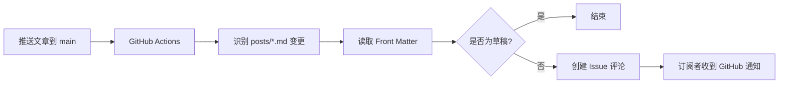

# 用 GitHub Issue 和 Actions 为静态博客实现新文章订阅

静态博客通常只有 RSS。RSS 很可靠，但读者需要自行准备阅读器，也不一定会及时看到更新。如果博客源码托管在 GitHub，还可以利用一个很容易被忽略的能力：**GitHub Issue 本身可以被用户订阅**。

本篇文章实现一套不依赖第三方推送平台的方案：读者订阅一个公开 Issue；当 `posts/` 中出现新的 Markdown 文章或文章更新时，GitHub Actions 自动在该 Issue 下发布评论。GitHub 会再根据读者的通知设置，发送站内通知或邮件。

## 最终效果

这套方案完成后有两条清晰的路径：

1. 作者向 `main` 推送文章。
2. GitHub Actions 识别本次变更的文章，生成标题、摘要、链接和发布日期。
3. Action 在指定 Issue 下创建一条评论。
4. 已点击 Issue `Subscribe` 的读者收到 GitHub 通知。

它特别适合内容以 Markdown 管理、源码公开托管在 GitHub 的个人博客。

## 为什么选择 Issue 订阅

相较于自建邮件列表、Webhook 服务或即时通讯机器人，这个方案的依赖非常少。

| 方式 | 优点 | 限制 |
| --- | --- | --- |
| GitHub Issue 订阅 | 无额外服务、读者可自主订阅与取消、GitHub 负责通知 | 读者需要 GitHub 账号 |
| RSS | 开放标准、无需账号、适合阅读器 | 需要读者使用 RSS 阅读器 |
| 邮件列表 | 触达直接 | 需要处理邮箱、退订、隐私与投递问题 |
| 机器人推送 | 即时、互动性强 | 平台 API、Token 和群组管理成本更高 |

Issue 订阅不取代 RSS，而是补充一种对 GitHub 用户更自然的订阅通道。博客可以同时保留 RSS、页面订阅入口和 Issue 更新通知。

## 工作原理

核心由四个部分组成：GitHub 的 `push` 事件、文章变更检测、Front Matter 解析，以及 Issue 评论 API。



### 1. 用路径过滤减少无关执行

工作流只关心文章目录，因此可以在触发器中限制路径：

```yaml
on:
  push:
    branches: [main]
    paths:
      - 'posts/**/*.md'
```

这样修改样式、图片或站点配置不会产生文章提醒，也不会浪费 Actions 执行时间。

### 2. 对比本次推送前后的提交

一次 `push` 可能包含一个或多个 commit。只比较 `HEAD~1` 与 `HEAD` 会漏掉同一次推送中较早的提交，因此应使用 GitHub 事件给出的前后 SHA：

```bash
git diff --name-only --diff-filter=AM "$BEFORE_SHA" "$AFTER_SHA" -- 'posts/**/*.md'
```

其中：

- `--name-only` 只输出文件路径。
- `--diff-filter=AM` 只保留新增（`A`）与修改（`M`）的文件。
- `-- 'posts/**/*.md'` 仅检查文章目录内的 Markdown 文件。

如果仓库是首次推送，前一个 SHA 会是全零值。此时改用 `git show` 获取当前提交中的文章文件即可。

### 3. 从 Front Matter 读取文章信息

D-blog 的文章在顶部使用 YAML 风格的 Front Matter：

```yaml
---
id: github-issue-blog-subscription
title: 用 GitHub Issue 和 Actions 为静态博客实现新文章订阅
excerpt: 不依赖第三方推送平台，实现自动的新文章提醒。
date: 2026-07-22
draft: false
---
```

通知脚本需要的字段很少：

- `id`：生成文章 URL，例如 `/post/github-issue-blog-subscription`。
- `title`：评论标题。
- `excerpt`：评论中的摘要。
- `date`：展示发布日期。
- `draft`：值为 `true` 时不通知。

生产环境中可以使用完整 YAML 解析器。不过为了使工作流不增加额外依赖，简单的单行字段可通过正则和逐行分割读取。对于多行 YAML、复杂嵌套对象或引号转义较多的内容，则应使用可靠的 YAML 解析库。

### 4. 使用 `GITHUB_TOKEN` 发布评论

`actions/github-script` 提供了已认证的 Octokit 客户端，可以直接调用 GitHub REST API：

```yaml
permissions:
  issues: write
```

```js
await github.rest.issues.createComment({
  owner: context.repo.owner,
  repo: context.repo.repo,
  issue_number: Number(process.env.ISSUE_NUMBER),
  body,
});
```

这里不需要个人访问令牌。GitHub 会自动为工作流注入 `secrets.GITHUB_TOKEN`。当前实现只需 `issues: write`，用于创建 Issue 评论。

## 实现教程

下面以 D-blog 的结构为例，从零配置一套可用的提醒工作流。

### 第一步：创建订阅 Issue

在仓库中创建一个公开 Issue，例如标题为“D-blog 更新订阅”。读者打开该 Issue 后点击 **Subscribe**，后续 Issue 评论就会进入其 GitHub 通知中心。

例如 D-blog 的订阅入口是：

```text
https://github.com/ououduck/D-blog/issues/6
```

Issue 编号是 URL 最后的数字，本例为 `6`。

### 第二步：确定接收通知的 Issue

D-blog 的工作流默认将提醒发送到 Issue `#6`，因此不需要额外创建仓库变量即可使用：

```yaml
env:
  ISSUE_NUMBER: ${{ vars.BLOG_NOTIFY_ISSUE_NUMBER || '6' }}
```

`BLOG_NOTIFY_ISSUE_NUMBER` 是可选的覆盖项。只有在未来需要更换订阅 Issue 时，才在仓库的 `Settings` -> `Secrets and variables` -> `Actions` -> `Variables` 中创建它：

```text
Name: BLOG_NOTIFY_ISSUE_NUMBER
Value: 12
```

配置后，通知会发送到 Issue `#12`；未配置时则始终发送到默认的 Issue `#6`。

### 第三步：创建工作流文件

在仓库新增 `.github/workflows/notify-post-update.yml`：

```yaml
name: Notify Blog Post Update

on:
  push:
    branches: [main]
    paths:
      - 'posts/**/*.md'
  workflow_dispatch:
    inputs:
      post_files:
        description: 'Markdown paths to notify, separated by new lines'
        required: true
        type: string

jobs:
  notify:
    runs-on: ubuntu-latest
    permissions:
      issues: write

    steps:
      - uses: actions/checkout@v5
        with:
          fetch-depth: 0
```

这里的 `fetch-depth: 0` 会取得完整 Git 历史。虽然比浅克隆稍多一些数据，但能保证 `before` SHA 在同一次包含多个 commit 的 push 中可用于比较，逻辑更可靠。

### 第四步：识别文章并发布通知

推荐把多篇文章合并为一条 Issue 评论。一次批量发布三篇文章时，读者只会收到一条通知，评论中列出全部文章。

当前实现将变更检测、草稿过滤和评论发布放在同一个 `actions/github-script` 步骤中。这样只要匹配到非草稿文章，Action 就一定会调用评论 API；若权限或 API 调用失败，工作流会明确失败，不会再出现绿色成功但没有评论的情况。

下面是核心逻辑的简化版：

```js
const childProcess = require('child_process');
const fs = require('fs');

const files = childProcess
  .execFileSync('git', ['diff', '--name-only', '--diff-filter=AM', beforeSha, afterSha, '--', 'posts/**/*.md'], { encoding: 'utf8' })
  .split(/\r?\n/)
  .filter(Boolean);

const posts = files.flatMap((file) => {
  const content = fs.readFileSync(file, 'utf8');
  const frontmatter = getFrontmatter(content);

  if (frontmatter.draft === 'true' || !frontmatter.id) return [];

  return [{
    title: frontmatter.title || frontmatter.id,
    excerpt: frontmatter.excerpt,
    date: frontmatter.date,
    url: `https://blog.pldduck.com/post/${encodeURIComponent(frontmatter.id)}`,
  }];
});

let body = '## D-blog has new article updates\n\n';
for (const post of posts) {
  body += `### [${post.title}](${post.url})\n\n`;
  if (post.excerpt) body += `${post.excerpt}\n\n`;
  if (post.date) body += `Published: ${post.date}\n\n`;
}
```

`encodeURIComponent` 不应省略。虽然 D-blog 的 `id` 通常是英文 slug，但对 URL 参数进行编码是稳妥的默认做法。

### 第五步：授予工作流权限

除了 YAML 中的 `permissions`，还需要在仓库设置中允许工作流令牌写入：

1. 打开 `Settings` -> `Actions` -> `General`。
2. 找到 `Workflow permissions`。
3. 选择 `Read and write permissions`。
4. 保存设置。

如果只保留只读权限，创建 Issue 评论会收到 `Resource not accessible by integration` 一类的错误。

### 第六步：手动验证通知

除了在推送文章时自动执行，工作流也支持在 GitHub Actions 页面手动运行。打开 `Notify Blog Post Update`，点击 **Run workflow**，选择 `main` 分支，并在 `Markdown paths to notify` 中填写一个文章路径，例如：

```text
posts/github-issue-blog-subscription.md
```

这会立即针对该文章创建一条 Issue 评论，是检查权限、订阅入口与通知设置的最快方式。

## 给读者的订阅入口

自动通知做好后，最容易遗漏的是让读者知道它的存在。建议在以下位置放置相同链接：

- 页脚：让全站访问者都能找到。
- 关于页：适合介绍博客订阅方式。
- 文章底部：读者刚读完内容时，订阅意愿通常最高。

按钮链接应直接指向 Issue：

```html
<a
  href="https://github.com/ououduck/D-blog/issues/6"
  target="_blank"
  rel="noopener noreferrer"
>
  前往订阅
</a>
```

读者只需登录 GitHub，打开该 Issue 并点击 **Subscribe**。取消订阅同样由 GitHub 原生提供，不需要网站存储用户信息。

## 常见问题

### 只修改旧文章，也会发通知吗？

会。当前方案的目标是“文章更新提醒”，新增与修改的 Markdown 都会被识别。如果只希望首次发布时提醒，需要额外比较文件在 `BEFORE_SHA` 中是否存在：不存在才视为新文章。

### 草稿为什么没有提醒？

这是预期行为。`draft: true` 的文章通常尚未公开，通知脚本会主动跳过它。将草稿改为 `draft: false` 后推送，便会成为可提醒的发布内容。

### 为什么我没有收到邮件？

首先确认已在目标 Issue 上点击 Subscribe。其次检查 GitHub 的 Notifications 设置：GitHub 可以只显示站内通知，也可以按仓库、参与情况或关注状态发送邮件。

### 我需要配置仓库变量吗？

不需要。D-blog 默认使用 Issue `#6`。只有需要迁移订阅入口时，才配置可选变量 `BLOG_NOTIFY_ISSUE_NUMBER`。变量值只应是数字，例如 `12`，不要填写 `#12` 或完整 URL。

### 为什么工作流成功却没有评论？

先确认触发提交确实修改了 `posts/**/*.md`，且文章没有 `draft: true`。当前工作流会在日志中打印识别到的文章路径；若评论 API 没有权限，工作流会失败并显示具体错误，而不会静默跳过。

## 安全与维护建议

- 不要将个人访问令牌写入工作流。优先使用 GitHub 自动提供的 `GITHUB_TOKEN`。
- 为默认订阅 Issue 提供回退值，并用可选仓库变量覆盖它，避免遗漏配置导致工作流静默跳过通知。
- 不要将用户邮箱或订阅名单提交到仓库。Issue 订阅由 GitHub 管理，博客不需要保存个人数据。
- 使用最小权限。当前只需要 `issues: write`；不要额外授予仓库写入或个人访问令牌权限。
- 为脚本保留草稿过滤与缺失 `id` 的告警，避免未完成文章或格式错误文章被推送出去。

## 总结

GitHub Issue + GitHub Actions 的文章订阅方案并不复杂：用 `push` 事件捕获文章变更，读取 Markdown 元数据，调用 Issue 评论 API，再由 GitHub 完成通知分发。

它的价值不在于替代 RSS，而在于为 GitHub 用户提供一个零额外注册、零额外服务、可随时取消的订阅方式。对于源码与内容都在 GitHub 中维护的静态博客，这是一条足够轻量、可维护且透明的更新通知链路。
