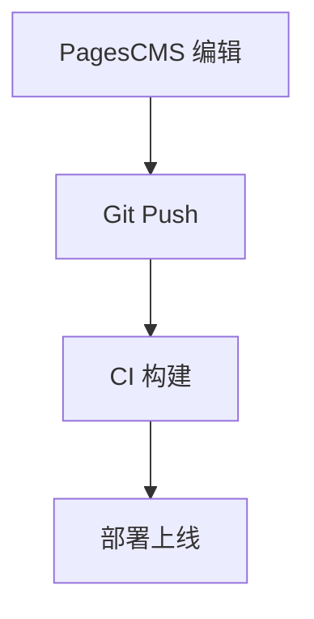

# PagesCMS 功能测试

这是一篇通过 PagesCMS 提交的测试文章，用于验证各项功能是否正常。

## 普通段落

正文支持标准 Markdown 语法，这里是一段普通文字。

## 代码块

```ts
function greet(name: string): string {
  return `Hello, ${name}!`;
}
console.log(greet('D-blog'));
```

## GFM 表格

| 功能 | 支持状态 |
| --- | --- |
| 段落 | ✅ |
| 代码高亮 | ✅ |
| 表格 | ✅ |

## 数学公式

$$
E = mc^2
$$

## Mermaid 图表



## 嵌套图片链接

点击图片可预览大图（使用 `[](img)` 嵌套语法）：


## 站内链接

访问[归档页面](/archive)查看所有文章。

---

> 如果你看到了这篇文章的完整渲染效果，说明 PagesCMS 提交流程一切正常。测试完成后可删除此文章。